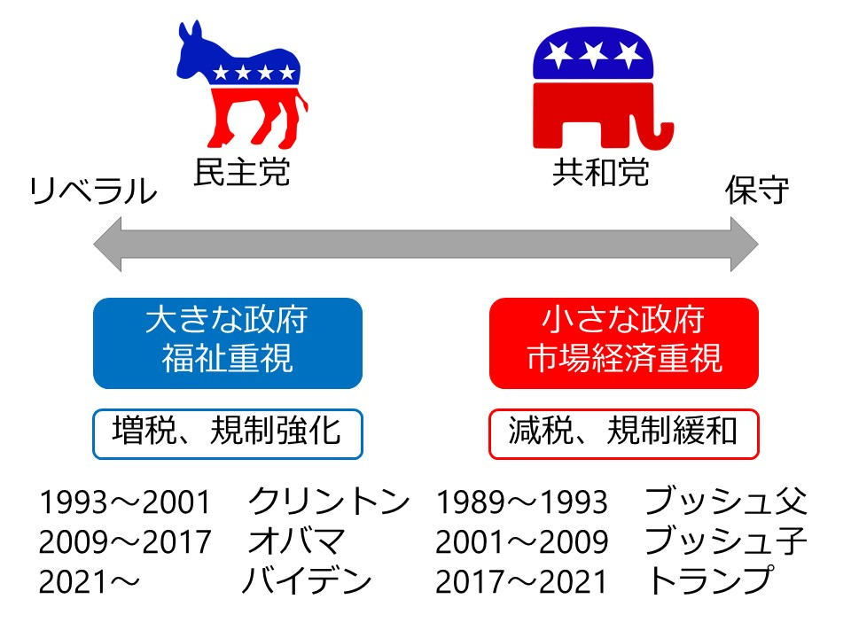
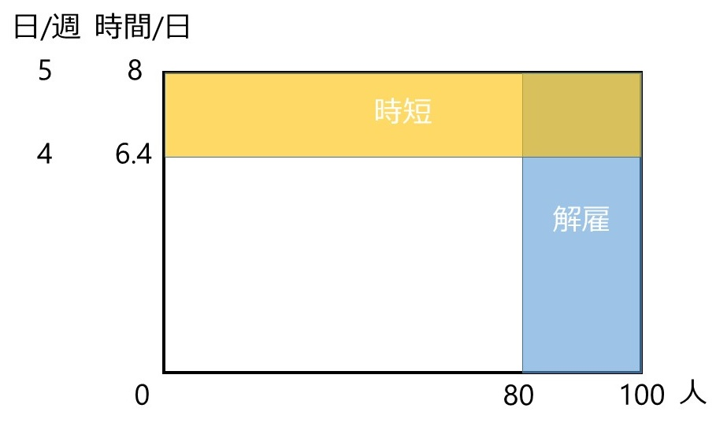
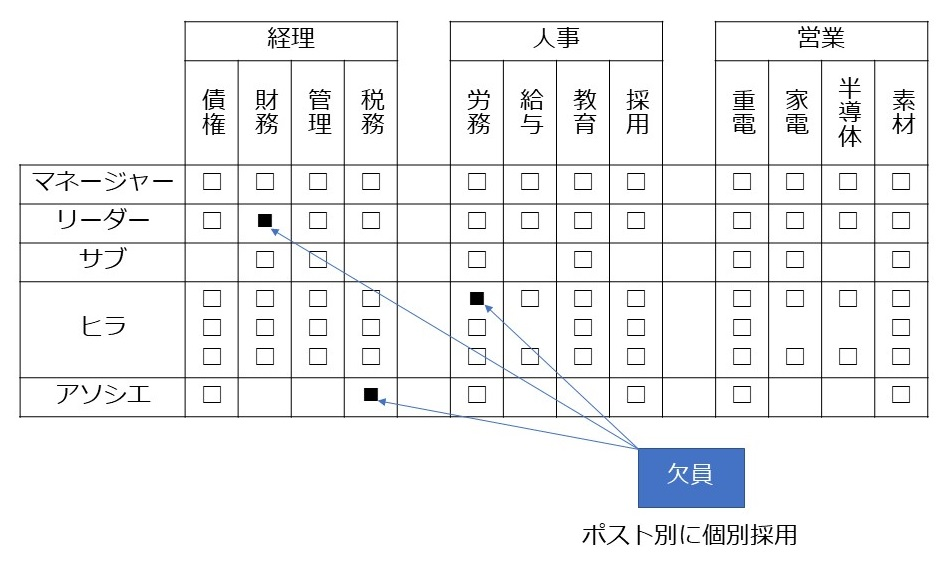
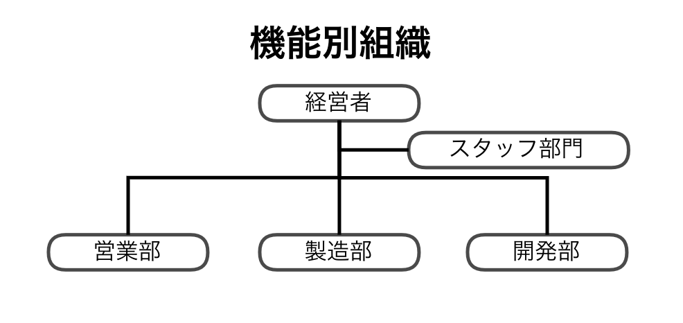
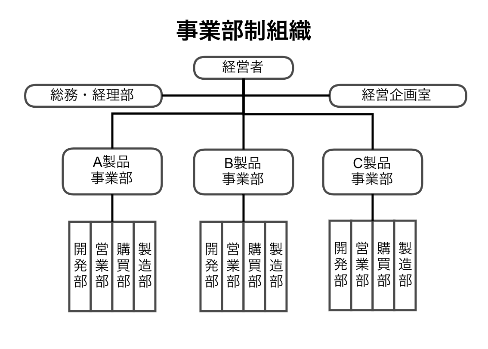
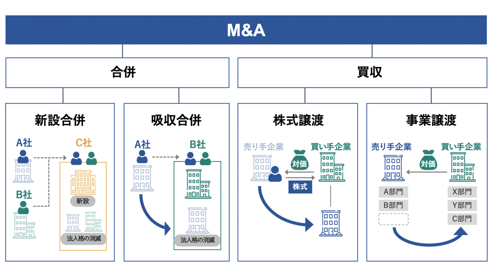

# アメリカ企業の経営システム {#usa}

```{r , echo = FALSE, warning = FALSE}
library(kableExtra)
library(vembedr)
#library(webshot2)
```

- 本章の構成は、以下のとおりです。

  - \@ref(us-external)では、アメリカ企業の経営システムの外部要因として、\@ref(us-culture)文化、\@ref(us-politics)政治システム・法制度、\@ref(us-economy)経済システムを整理します。
  
  - \@ref(us-manager)では、アメリカ企業の経営者の特徴として、\@ref(us-selection)選抜・移動、\@ref(us-payment)報酬、\@ref(us-education)教育を整理します。
  
  - \@ref(us-management)では、アメリカ企業の経営プロセスを\@ref(us-plan)計画、\@ref(us-organization)組織化、\@ref(us-command)指揮・調整、\@ref(us-control)統制を整理します。
  

## アメリカの文化・政治・経済 {#us-external}

- 本節では、アメリカ企業経営の外部要因として、アメリカの文化・政治・経済を確認します。

  - まず、[文化](#us-culture)を整理します。

  - 次に、[政治システム・法制度](#us-politics)を整理します。

  - 最後に、[経済システム](#us-economy)を整理します。

### 文化 {#us-culture}

#### 歴史

- 1776年にイギリスからの独立を宣言し、アメリカ合衆国が建国されました[^1]（イギリスが独立を認めたのは1783年のパリ条約）。国としての歴史は250年程度です。

  - 1492年にコロンブスが北アメリカ大陸を発見します。16世紀になると、イギリス、フランス、オランダ、スウェーデンなどが植民地を建設します。

  - 1620年にイギリスの清教徒（ピューリタン）[^2]がメイフラワー号でアメリカに移民します。
  
  - その後、領土はイギリス、フランス、スペイン、メキシコなどから割譲あるいは併合し拡大し、1840年代には西海岸に到達しました。
  
[^1]: [NHK for School "アメリカの移民と開拓"](https://www2.nhk.or.jp/school/movie/clip.cgi?das_id=D0005403149_00000)にある動画を参照してください。

[^2]: 清教徒（ピューリタン）は、イギリスにおけるプロテスタントの一派です。当時、神父など聖職者の権威が強かったカトリックに対し、宗教革命がヨーロッパ各地で起こっていました。

- 人種構成は多様ですが、初期の移民の文化の影響が強いです。

  - Weber(1905)[^3]は「プロテスタンティズムの倫理[^4]が、近代資本主義の成立について精神的側面から影響を及ぼした」と主張しました。

  - 清教徒（ピューリタン）など初期の移民が重視したのは個人の「自由」と神の前の「平等」であり、「フロンティア（開拓者）精神」です。ただし、当初の平等はキリスト教徒の白人男性が対象で、女性や黒人奴隷、先住民は含まれていませんでした（[船津靖 "「自由・平等・フロンティア精神」アメリカ人が最も大切にするもの"](https://yumenavi.info/lecture.aspx?GNKCD=g008685)）。
  
  - 平等は時代を経て達成されていきますが、アメリカ社会における「プロテスタント系キリスト教徒のアングロサクソン系白人（WASP: White Anglo Saxon  Protestant）」の影響力は依然として大きいです。
  
    - WASPでない大統領は、ケネディ大統領、オバマ大統領の2人だけです。  
<br>

  - 移民（アジア系、ヒスパニックなど）の増加と白人と非白人の出生率の差によって、2010年から2020年までの人口変化において、白人が減り、他の人種が増加しました（図\@ref(fig:RACE)参照）。この傾向は継続し、人種構成において白人の割合は低下すると予想されています（表\@ref(tab:USPOPULATION)参照）。
  
    - 影響力の低下に不満を持つ白人が、トランプ（元）大統領の支持層となりました。

```{r RACE, echo = FALSE, out.width="960px", fig.cap="アメリカの人種別人口増減"}
knitr::include_graphics("https://assets.media-platform.com/bi/dist/images/2021/08/13/statics.jpg")
```

出所）[BUSINESS INSIDER JAPAN "史上初、アメリカで白人の人口が減った—— 2020年国勢調査"](https://www.businessinsider.jp/post-240340)    

```{r USPOPULATION, echo = FALSE, warning = FALSE, fig.align="center"}
uspop <- read.csv("USPOPULATION.csv", header = TRUE)
knitr::kable(uspop, align = "cccccc", caption = "アメリカの総人口における人種の割合", booktabs = FALSE)
```

出所）[NHK for School "アメリカの総人口における人種の割合"](https://www.nhk.or.jp/school/syakai/10min_tiri/kyouzai/001601.pdf)

[^3]: Weber(1905)『プロテスタンティズムの倫理と資本主義の精神』については、<!---（[平原卓 "ヴェーバー『プロテスタンティズムの倫理と資本主義の精神』を解読する"](https://www.philosophyguides.org/decoding/decoding-of-weber-geist/)を参照してください。要点だけ知りたい場合は、--->[平原卓 "ヴェーバー『プロ倫』を超コンパクトに要約する"](https://www.philosophyguides.org/compact/weber-geist-super-compact-summary/)を参照してください。

[^4]: アメリカ建国の父の1人で100ドル札の肖像にもなっているベンジャミン・フランクリン（1706-1790）は、その実践者の代表的存在です。「フランクリンの十三徳」については、[人事部長の教養100冊 "「フランクリン自伝」Ｂ・フランクリン" ](https://jinjibuchou.com/%E3%83%95%E3%83%A9%E3%83%B3%E3%82%AF%E3%83%AA%E3%83%B3%E8%87%AA%E4%BC%9D)を参照してください。


#### Hofstedeの指標

- 権力格差の指標は40で、低いほうに分類されます。

  - 上下関係は目的を果たすために必要な便宜的なものと捉えられます。社会的地位が高くても、人として平等と考えます。
  
  - 警察、軍隊などはっきりとした階級がある組織は例外ですが、民間企業ではファーストネームで呼び合うなど、役職で呼ぶことは少ないです。
  
  - 意思決定に関しては迅速さが求められる（短期志向：26）ため、民間企業でもトップダウン型です（[「Meyerのカルチャーマップ」の"決断"](#meyer)）。

- 個人主義の指標は91で、世界的にみても高いです。

  - 個人の権利、自由、責任を強調し、ユニークさが尊重されます。

  - 労働者と企業は雇用契約書に職務（業務内容）を明記し、契約を結びます。
  
    - 労働者は企業に労働力という商品を売ると考えます。その価値を高めるために、経理、営業、マーケティング、広告といった専門能力を教育を通じ高めようとします。
  
    - 労働力は商品であるため、高く売れるところにすぐに移動する（転職が多い）傾向があります。

- 男性性の指標は62で、高いほうに分類されます。

  - アメリカンドリームすなわち物質的成功を収めることが評価されます。
  
  - 社会進出する女性は多く、女性の企業経営者も増えていますが、一方で「ガラスの天井」[^5]という見えない壁の存在も指摘されています（図\@ref(fig:glassceiling)）。

[^5]:女性やマイノリティが白人男性と同等の業績を出していても、上級管理職やトップの地位には昇進させないようにする企業や組織内の見えない障壁のことを指します。

```{r glassceiling, echo = FALSE, out.width="960px", fig.cap="「ガラスの天井」指数の国際比較"}
knitr::include_graphics("https://www.economist.com/img/b/1000/590/90/sites/default/files/20200307_WOC548.png")
```

出所）[The Economist "Iceland leads the way to women’s equality in the workplace"](https://www.economist.com/graphic-detail/2020/03/04/iceland-leads-the-way-to-womens-equality-in-the-workplace)

- 不確実性回避の指標は46で、低いほうに分類されます。

  - 開拓者として成功するためには誰よりも早く未開地に着くことが何より重要で、そのうえで大切なスピードを追求する過程でのある程度の失敗はやむを得ないとの考えが、今でも残っています。（Meyer. (2014, 日本語版 pp.186-187)）
  
  - 起業し倒産することが「取り返しのつかない失敗」とはならないため、ベンチャー企業が多く誕生しています。

- 長期志向の指標は26で、世界的にみても低いです。すなわち短期指向です。

  - 不確実性回避と同様に、開拓者精神から短期的利益を追求し、時間にも厳しいです。
  
    - 初対面の相手に親しく（柔らかく）接することが多く、笑顔を絶やさず、すぐにファーストネームで呼び始めたりします。（Meyer. (2014, 日本語版 p.217)）
  
    - ただし、このように友好的に振舞うことは素早くビジネスを始めるためのスキルであり、長く続く友情に発展するとは限りません。
    
  - 長すぎる議論を嫌い、決断はいつでも修正できるとの考えのもと、不十分な情報に基づくものであっても[^6]素早く決断を下すことを好みます。
    
    - 感情的信頼を築くのに何時間もかけるのは時間の無駄遣いに感じる（Meyer. (2014, 日本語版 p.227)）一方で、公私混同しないために仕事上の相手とは意図的に個人的な関係を築かないようにすることがプロフェッショナルであると考えます。（Meyer. (2014, 日本語版 pp.210-211)）
    
  - 山岸(1999, p.26)によると、質問紙調査で「アメリカ人は日本人よりもずっと、他者一般に対する信頼感が強い」という結果が出ています。

[^6]: 不確実性回避の指標が低いことと関連しています。

- 充足志向は68で、高いほうに分類されます。

  - 不確実性回避の指標が低いことや短期志向と関連しています。
  
  - 人前では喜びや楽観主義を表に出すと期待されています。

- アメリカは世界で最も低文脈な社会です。（Meyer. (2014, 日本語版 p.59)）

  - 国民は世界各国からの移民で構成されています。移民はそれぞれ別々の歴史、別々の言葉、別々のバックグラウンドを持っています。
  
    - 建国以来の歴史も短いため、共有する文脈が少なくなります。

  - メッセージを伝える際は曖昧さや誤解が生じる余地をなくして、できるだけはっきりと明快に伝えることが、コミュニケーションの基本になります。


### 政治システム・法制度 {#us-politics}

- アメリカは民主主義国家であり、三権分立が確立しているため、政治は安定しています。

  - ジャーナリズムが独立しており、政治家や企業の不正は厳しく追及されます。

- アメリカではさまざまな価値観が認められますが、政党としては「保守」系の共和党と「リベラル」系の民主党の二大政党に概ね集約されます（図\@ref(fig:USPARTY)）。

  - 二大政党の間で政権交代が繰り返されています。大統領は1期4年で、再選されると2期8年まで可能です。
  
- 大統領選においては各党の候補者選びから1年をかけて討論を重ねるため、将来実施されるであろう政策も予想が立ち（またある程度の政策の継続性も期待でき）ます。
  
  - 政権交代があっても「政策の予測可能性」が高いことから、企業は長期(5〜10年)の経営・設備投資計画が立てやすくなります。

```{r USPARTY, echo = FALSE, out.width="960px", fig.cap="アメリカの二大政党"}

```

- 多民族国家で低文脈社会であることから、法律や契約書は条文が詳細に記載されます[^7]。

  - 契約の強制は司法制度が重要になります（\@ref(us-management)[法制度](#law) ）。

[^7]:大学で使用する経営学の教科書も日本に比べ厚いものが多いです。

- 自由競争を重んじるため、経済に対する政府関与の度合いは他国に比べ低いです。

  - 自由競争を阻害する独占や寡占を禁止する独占禁止法（反トラスト法）により、スタンダード・オイルやAT&Tなど巨大企業が分割されたこともあります[^8]。

[^8]:グーグル、アップル、フェイスブック、アマゾンなどのIT企業も、その対象として検討されたことがあります（[NHK(2020b)](https://www3.nhk.or.jp/news/special/sakusakukeizai/articles/20201023.html)）。

### 経済システム {#us-economy}

- アメリカ経済の特徴は、経済的自由の高さです。

  - 経済規模は世界一であり、数多くの外国企業が参入してきます。

  - 起業、買収・合併（M&A）、倒産が頻繁に起こるなど、市場競争が厳しいです。
  
    - 起業が多いのは、不確実性回避の指標が低いことが背景にあります。
    
- 高い経済的自由の背景として、柔軟な労働市場の存在が挙げられます。

  - 不景気で労働力に余剰が生まれたとき、容易にレイオフ（一時解雇）[^9]を行うことができます。
  
    - 日本ではレイオフではなく、雇用を確保した上で時短が行われることが多いです（図\@ref(fig:layoff)）。
  
  - 不景気のときに容易にレイオフできることから、企業は好景気で人手不足になったときは採用を積極的に行います。
  
    - これを労働市場の流動性が高いといいます。
  
  - レイオフされた労働者は再雇用を待たなくても、（レイオフされた企業よりも業績がいい＝賃金水準の高い）他社に比較的容易に再就職できます。

  - アメリカの労働者は専門性を持っていて、職種ごとに採用されるため、転職先の仕事を学びなおす必要がありません。
  
    - 労働市場の流動性が高いことは、労働者にとって決してマイナスとはいえないことになります。
  
  - 経済全体から見ても、不況業種から好況業種へ労働力が移動するというプラスの効果があります。

[^9]:業績が回復するまでの期間中、労働者を一時的に解雇することです。長年培ってきた労働者の経験やスキル、ノウハウを維持する目的から、基本的に勤続年数の短い労働者からレイオフされ、再雇用のときは長く働いている労働者から雇用されます。

```{r layoff, echo = FALSE, out.width="960px", fig.cap="労働時間20%削減の方法"}

```


- 高い経済的自由の背景として、発達した金融市場の存在が挙げられます。

  - 証券市場が発達していて、他国と比較して企業は証券市場から多く資金を調達します。
  
  - 起業する場合でも、ベンチャーキャピタル[^10]からの資金調達が可能です。

    - 借入（負債）でなく、株式（資本）での資金調達が多いため、倒産したときのリスクは起業家ではなく、投資家が負担することになります。
    
  - 金融制度の面からも、倒産からの再チャレンジが容易となっています。
  
    - 不確実性回避の指標が低いのも、文化的要因だけでなく社会制度にも起因するものと考えられます。

[^10]:未上場時に投資を行って、投資先の企業が上場や成長した後に株式を売却もしくは事業を売却して、キャピタルゲイン（当初の投資額と株式公開後の売却額との差額）を得ることで収益を得る企業です。
    
- 経済への政府関与は低いです。経済規模に比べ政府支出は少なく、国営企業も少ないです。

  - 年金や健康保険といった社会保障は、他国に比べ民間部門が担う部分が大きいです。
  
    - アメリカでは一部を除き、基本的に健康保険（医療保険）は個人で民間保険に加入します。
    
    - アメリカの医療費は高いことで有名で、盲腸の手術で150～440万円するとされます（[日本医師会 "アメリカは医療格差社会"](https://www.med.or.jp/people/info/kaifo/compare/#:~:text=%E5%9C%A8%E3%83%8B%E3%83%A5%E3%83%BC%E3%83%A8%E3%83%BC%E3%82%AF%E7%B7%8F%E9%A0%98%E4%BA%8B%E9%A4%A8%E3%81%AE,%E3%82%92%E6%B1%BA%E5%AE%9A%E3%81%97%E3%81%A6%E3%81%84%E3%81%BE%E3%81%99%EF%BC%89%E3%80%82)）。
    
    - 健康保険は給与の一部として支給されることも多い一方、失業すると収入だけでなく健康保険も失うことになるので、影響が大きいです。
    
- アメリカ社会では、機会の平等は高く求められます。

  - 人種や性別、民族などによる社会的差別を改善し、雇用や教育などにおいて採られる優遇措置をアファーマティブ・アクション（積極的格差是正措置）といいます。

- その一方で、家計の所得・資産の不平等は大きいです（結果の不平等）。

  - 上位1%の人たちの所得は1981年に全体の8.2%でしたが、2012年には倍以上の20%に高まっています（図\@ref(fig:inequality)）。その一方で、所得が最も少ない10%の層の人たちの収入は、2000年から2008年の間に実質で10%減少しました（[櫨 (2015)](https://www.nli-research.co.jp/report/detail/id=42347?site=nli)）。
  
  - アファーマティブ・アクションによっても、人種間の所得・資産格差は存在し続けています。2019年の典型的な非ヒスパニック系白人世帯の純資産は、非ヒスパニック系黒人世帯の約8倍でした（[CNN.co.jp (2021)](https://www.cnn.co.jp/business/35172251.html)）。
  
```{r inequality, echo = FALSE, out.width="960px", fig.cap="上位1%の人たちの所得シェア"}
knitr::include_graphics("https://www.nli-research.co.jp/files/user/report/report/2015/04/image/repo1504-1.jpg?v=1448125638")
```

出所）[櫨 (2015)](https://www.nli-research.co.jp/report/detail/id=42347?site=nli)

<!-- https://www5.cao.go.jp/keizai2/keizai-syakai/future2/20200415/shiryou2_2.pdf -->

<span style="font-size: 150%">**参考文献**</span>

[CNN.co.jp (2021)「4つのグラフから見る　米国の黒人と白人の格差」](https://www.cnn.co.jp/business/35172251.html)

Meyer, E. (2014). The Culture Map: Breaking Through the Invisible Boundaries of Global Business. PublicAffairs.（日本語版　樋口武志（訳）・田岡恵（監訳）(2015)『異文化理解力』英治出版.）

[NHK (2020b)「グーグルに何が起きているの？」](https://www3.nhk.or.jp/news/special/sakusakukeizai/articles/20201023.html)

Weber, Max (1905). Die protestantische Ethik und der Geist des Kapitalismus. （日本語版　大塚久雄（訳）(1989)『プロテスタンティズムの倫理と資本主義の精神』岩波文庫.）

[櫨浩一 (2015)「巻き起こる格差議論－ピケティ「21世紀の資本」の意味」基礎研REPORT  2015年4月号](https://www.nli-research.co.jp/files/topics/42347_ext_18_0.pdf?site=nli)

山岸俊男 (1999)『安心社会から信頼社会へ』中公新書1479.


## アメリカ企業の経営者 {#us-manager}

- 本節では、アメリカ企業の経営者に関連する項目を整理します。

  - まず、アメリカ企業の経営者のキャリア形成のプロセス、[選抜・移動](#us-selection)を整理します。

  - 次に、アメリカ企業の経営者の[報酬](#us-payment)について、概要を整理します。

  - 最後に、アメリカ企業の経営者の教育的背景（学歴）や、経営学の[教育](#us-education)の位置付けについて整理します。

### 選抜・移動 {#us-selection}

<!--　新卒採用や昇進などの労働システムのあり方（ジョブ型・メンバーシップ型）についてはAppendixでまとめる。-->

- [Strategy& (2019)](https://www.strategyand.pwc.com/jp/ja/publications/2018_ceo-data-media-release-jp.pdf)が行った、世界の上場企業における時価総額の上位2,500社を対象にした調査によると、アメリカ企業の経営者（最高経営責任者CEO:Chief Executive Officer）の平均像は、以下の通りです。 [日本](#japan-selection) [アジア](#asia-selection)

  - 2018年に就任したCEOの年齢の中央値は54才です。
  
  - 内部昇格したCEOが79%で、外部招聘のCEOが21%でした。
  
    - 新任CEOの94%が他企業での職務経験があります。
    
    - ヘッドハンティングが盛んで、プロ経営者（A社社長退任→B社社長就任）もいます。
    
      - 新任CEOの26%が株式公開会社でのCEO経験を有しています。
    
  - 海外での勤務経験を有するCEOは33%でした。
　
    - 世界平均レベルですが、西欧諸国（63%）に比べると低いです。
    
    - Edfelt (2010, pp.50-52)によると、アメリカ企業は以下の特徴があります。
    
      - 海外に居住・勤務経験のある経営者は1/3
      
      - 「経営者に国際経験は重要？」との問いには、Yesは15%、Noは54%

      - 「国際ビジネスに外国語は必要？」との問いには、同意と多少同意の合計が34%

  - 新任CEOの85%がアメリカ国籍でした。

  - 新任CEOの女性比率は1.1%でした。
　
    -  [Forbes JAPAN (2014)](https://forbesjapan.com/articles/detail/990)によると、アメリカの全企業の23%の780万社が女性が経営する企業であり、特に、ヘルスケア・教育サービス分野では、61%の企業が女性CEOです。

    - この20年間、女性の起業率は男性の2倍であることから、「ガラスの天井」を感じた女性が多く起業したと考えられます。

  - 新任CEOの53%がMBA（経営学修士）保有者です。
  
    - 世界平均(33%)を大きく上回ります。

  - 民間と政府で相互に転職することがあり、「回転ドア」と呼ばれます。民間経営者が政府高官になることもあります。

- 移動の多さは、個人主義の高さや不確実性回避の低さから解釈できます。

### 報酬 {#us-payment}

<!--
　大企業経営者　11.3億円　日本は1億円以上出す企業は少ない
　ストックオプション　一定期間内にあらかじめ決められた価格で所属する会社から自社株式を購入できる権利
　高報酬はプロ経営者が多いことが背景にある　外部登用の際、成功報酬としてストックオプションが付与されることが多い
-->

- [ウイリス・タワーズワトソン (2022)](https://www.wtwco.com/ja-JP/News/2022/08/report-fy2021-comparison-of-compensation-for-ceos-and-ned-between-japan-the-united-states-and-europe) によると、アメリカ企業CEOの報酬（2021年度）の中央値は16.0億円でした（図\@ref(fig:g5ceopay)）。

```{r g5ceopay, echo = FALSE, out.width="960px", fig.cap="CEO報酬比較（2021年度）"}
knitr::include_graphics("https://media.wtwco.com/-/media/WTW/News/2022/08/report-fy2021-comparison-of-compensation-01.png?modified=20220817061527&imgeng=meta_true")
```

出所）[ウイリス・タワーズワトソン (2022)](https://www.wtwco.com/ja-JP/News/2022/08/report-fy2021-comparison-of-compensation-for-ceos-and-ned-between-japan-the-united-states-and-europe)

- ダウ平均の構成企業でみると、経営トップの年間報酬で最高額だったのはナイキの5349万ドル（58.3億円）です（表\@ref(tab:uspay)）。

```{r uspay, echo = FALSE, fig.align="center"}
uspay <- read.csv("uspay.csv", header = TRUE)
knitr::kable(uspay, caption = "ダウ平均構成30社の社長の年収（1～5位）", booktabs = FALSE)
```

注）1ドル＝109円で換算  
出所）日経ヴェリタス（日経電子版）[^11]

[^11]:日経ヴェリタス（日経電子版） 2021年6月27日「社長の給料、日米で16倍差　米国平均は23億円」

- 企業の経営トップの報酬が従業員の賃金の何倍かを示す数値を**ペイレシオ（pay ratio）**といいます。

  - 日本経済新聞[^12]によると、ペイレシオが高い企業（2018年の公表当時）3社はマクドナルド3101倍、ウォルマート1188倍、ジョンソン・エンド・ジョンソン452倍となっています。

  - [鈴木 (2017)](https://www.dir.co.jp/report/column/20170921_012304.html)によれば、アメリカ企業のペイレシオは「1965年には平均20倍であったものが、1989年に59倍、2000年に376倍になったのち、2016年では271倍」に拡大しています。

[^12]:日本経済新聞朝刊　2018年5月13日「米報酬、企業差が鮮明「CEOは社員の何倍か」開示」

- アメリカ企業の経営者の報酬が高額である背景には、その報酬多くが業績連動報酬[^13]であるためです。

[^13]:業績連動報酬については、[日本経済新聞朝刊　2018年12月6日　きょうのことば](https://www.nikkei.com/article/DGXKZO38600620V01C18A2EA2000/?n_cid=SPTMG053)を参考にしてください。

- 業績連動報酬のなかでは、「あらかじめ決められた価格（図\@ref(fig:stockoption)では1円）で株式を購入できる」ストック・オプションが代表的存在です。

  - ストック・オプションは、経営者にとって「業績向上⇒企業価値の向上⇒株価の上昇⇒売却益増」といった好循環に対するインセンティブとして有効な制度となり得ます。
  
```{r stockoption, echo = FALSE, out.width="960px", fig.cap="ストック・オプションのスキームイメージ"}
knitr::include_graphics("https://www.dir.co.jp/common/img/report/20140108_008079_01.PNG")
```

出所）[大和総研](https://www.dir.co.jp/report/consulting/human-capital-management/20140108_008079.html)


<!--
日本経済新聞2018年12月12日　CEO報酬、アメリカは日本の6倍　首位は117億円 

英ＣＥＯの給料、一般社員の１６７年分　男女間でも格差
(https://www.cnn.co.jp/business/35124268.html)
-->

### 教育 {#us-education}

- アメリカ企業のCEOは高学歴といえます[^14]。

  - Edfelt (2010, pp.42-43)によると、アメリカ企業CEOの学歴は以下の特徴があります。
  
    - 大企業CEOの98%が大卒で、専攻の内訳は工学21%、経済学15%、経営学13%です。

    - 修士以上の学位をもつアメリカ人は、25才以上人口の10%に過ぎませんが、大企業CEOの67%が修士以上の学位を保有しています。

    - 大企業CEOの保有する修士以上の学位の内訳はMBA40%、法学10%となりますが、MBA以外の学位のうち21%はPh.D.（博士号）です。

  - [日本労働研究機構 (1998)](https://warp.da.ndl.go.jp/info:ndljp/pid/11486206/db.jil.go.jp/db/seika/zenbun/E2000014381_ZEN.htm)の調査によると、アメリカ企業の人事・営業・経理部課長は32-40%がMBAを保有し、Ph.D.（博士号）保有者もいます（図\@ref(fig:uscareer)）。
  
```{r uscareer, echo = FALSE, out.width="960px", fig.cap="アメリカ企業部課長職の学歴"}
knitr::include_graphics("https://warp.da.ndl.go.jp/info:ndljp/pid/11486206/db.jil.go.jp/db/seika/zenbun/IMAGE/E2000014381-ZU127.GIF")
```

出所）[日本労働研究機構 (1998)](https://warp.da.ndl.go.jp/info:ndljp/pid/11486206/db.jil.go.jp/db/seika/zenbun/E2000014381_ZEN.htm)

[^14]:Appleのティム・クックCEOなど、有名企業のCEOの経歴に興味のある人は[キャリハイ転職](https://www.recme.jp/careerhigh/entry/usaceo)の記事を見てみてください。


- アメリカにおいて、経営学は学問として広く認知されています。

  - 全米の大学学部の22%、大学院修士課程の25%に経営学専攻があります（Edfelt (2010, p.43)）。
  
- アメリカ企業において、内部昇進・転職に伴う昇進に関わらず、昇進には職位に見合った能力が求められますが、その証明として学位が多く利用されます。

  - アメリカに限らず欧米では、「仕事」の内容、範囲、責任、権限などを「職務記述書」ないし「権限規程」などの様式に、誰がみてもまぎれのないように明確に決めています（濱口 (2013, p.30)）。
  
  - 採用は図\@ref(fig:uspost)のように「必要なときに、必要な資格、能力、経験のある人を、必要なだけ」採用する欠員補充が原則となります（濱口 (2013, p.40)）。
  
  - 一つ一つの職業について、その職業を遂行する知識、経験、能力を兼ね備えた一人前の労働力に対する職種別の賃金が決まっています（濱口 (2013, p.85)）。

```{r uspost, echo = FALSE, out.width="960px", fig.cap="欧米の採用"}

```

出所）海老原 (2016)

<!--
https://www.kantei.go.jp/jp/singi/kyouikusaisei/teigen.html
https://www.kantei.go.jp/jp/singi/kyouikusaisei/pdf/dai3_2.pdf
-->

<span style="font-size: 150%">**参考文献**</span>

Edfelt, Ralph B. (2010). Global Comparative Management. SAGE.

[Forbes JAPAN (2014)「アメリカ出世事情・女性CEOが誕生する理由」](https://forbesjapan.com/articles/detail/990)

Meyer, E. (2014). The Culture Map: Breaking Through the Invisible Boundaries of Global Business. PublicAffairs.（日本語版　樋口武志（訳）・田岡恵（監訳）(2015)『異文化理解力』英治出版.）

[Strategy& (2019)「2018年 CEO 承継調査」](https://www.strategyand.pwc.com/jp/ja/publications/2018_ceo-data-media-release-jp.pdf)

[ウイリス・タワーズワトソン (2021)「ウイリス・タワーズワトソン、 『日米欧CEOおよび社外取締役報酬比較』 2021年調査結果を発表」](https://www.willistowerswatson.com/ja-JP/News/2021/07/report-fy2020-comparison-of-compensation-for-ceos-and-ned-between-japan-the-united-states-and-europe)

海老原嗣生 (2016)『お祈りメール来た、日本死ね』文春新書1105.

[キャリハイ転職「「元軍人から高校からはじめたバイトまで」P&G、Apple等、米国時価総額トップ15人のCEOの経歴を調べた」](https://www.recme.jp/careerhigh/entry/usaceo)

[鈴木裕 (2017)「社長の報酬は社員の何倍？—米英で分かれたペイレシオ開示政策—」大和総研](https://www.dir.co.jp/report/column/20170921_012304.html)

[大和総研 "ストック・オプション導入コンサルティング"](https://www.dir.co.jp/business/consulting/compensation/stock-option.html)

[日本労働研究機構 (1998)「国際比較：大卒ホワイトカラーの人材開発・雇用システム　－日、米、独の大企業」](https://warp.da.ndl.go.jp/info:ndljp/pid/11486206/db.jil.go.jp/db/seika/zenbun/E2000014381_ZEN.htm)

濱口桂一郎 (2013)『若者と労働』中公新書ラクレ465.

## アメリカ企業のマネジメント {#us-management}

- 本節では、アメリカ企業のマネジメントに関連する項目を整理します。

  - まず、アメリカ企業の[計画](#us-plan)を整理します。

  - 次に、アメリカ企業の[組織化](#us-organization)について、概要を整理します。

  - 次に、アメリカ企業の[指揮・調整](#us-command)について、概要を整理します。

  - 最後に、アメリカ企業の[統制](#us-control)について、概要を整理します。

### 計画 {#us-plan}

- Fayolの「計画（planning）」は、目的達成のための活動計画（年次予算や中期経営計画など）を策定することです。[Fayolの経営管理プロセス](#fayol)

  - 短期（月次・年間）の計画は「予算」といわれます。生産数量また生産に必要な原材料の数量や販売価格を決め、売上と費用から利益の見込み・目標を立てます。
  
  - 生産販売計画が決まると、それを実現するための投資計画を立てる必要があります。通常、数年間の投資回収期間を想定します。
  
  - 予算とは別に、中期（3-5年）、長期（10年）など、経営者の在任期間あるいはそれ以上の計画も立てることがあります。

- アメリカ企業は他国よりも戦略的な長期計画を策定を好む傾向があります（Edfelt (2010, p.52)）。

  -アメリカ企業は他国よりも専門家（経営コンサルタント）を雇い、計画を立てることが多いです。
  
  - コンサルティングは、19世紀末の技術者による時間動作（能率）研究が発祥です。計画を立て効率的に業務を遂行するのは、Taylorの科学的管理法にまで遡れます。
  
  - 計画の範囲は時代を追うごとに、範囲を広げ高度になります。
  
    - 1950-60年代は生産の場所（工場立地）、時間、規模、範囲という「生産計画」が中心でした。
    - 1960-70年代になると、政治・経済・技術・文化他の評価、企業内部の強みと限界といったSWOT分析を踏まえた戦略が計画に組み込まれます。
    
    - 1980年代以降は、戦略性をもって計画を立てることは、経営そのものとなります。

  - 計画の範囲が広がるのに応じて、コンサルティングにも変化が生じました。
  
    - 1970年代までには、会計事務所は従来から行ってきた税務・監査業務のほかに、経営コンサルティング（マネジメント助言）を提供するようになりました。

    - 1980年代には、コンサルティング業はさらに発展し、財務会計や税務に加え、生産システム、情報システムをも含む助言を行うようになりました。
    
- 経営学が学問として認知され信頼されていること、また不確実性回避の傾向が低いことから、新しい経営手法を積極的に導入する傾向があります。

### 組織化 {#us-organization}

- Fayolの「組織化（organizing）」は、製造や営業といった事業活動が効率良く実行されるような組織構造（人と仕事の配置）を構築することです。[Fayolの経営管理プロセス](#fayol)

  - 企業にとって望ましい組織は、環境（規模、戦略など）によって異なります。
  
- 企業規模が小さく、製品数が少ない企業は機能別組織が適しています（図\@ref(fig:org1)参照）。

  - 機能別組織のメリットは、専門性を高めやすいことです。
  
  - 経営者に権限が集中するシンプルな階層構造のため、統制を図りやすいです。
  
  - 機能別組織のデメリットは、組織が大きくなると経営者の負担が大きくなることです。
  
  - 部門管理者が専門化することで全社的なマネジメント力がある人材が育ちにくい面もあります。

```{r org1, echo = FALSE, out.width="960px", fig.cap="機能別組織"}

```

出所）[ゆうゆうぶろぐ (2020)](https://life-is-yuyu.com/consultant/business-management/function-divisional/)

- 企業規模が大きく、大規模で製品数が多いと事業部制組織が適しています（図\@ref(fig:org2)参照）。

  - 事業部別組織のメリットは、意思決定が速くなることです。
  
  - 経営者が業務的管理から解放され、戦略的意思決定に多くの時間を使えるようになります。
  
  - 事業部別組織のデメリットは、各事業部の機能が重複することでコストがかさむことです。
  
  - 各事業部がそれぞれの利益の達成にこだわり、全社的には最適な意思決定ができない恐れがあります。

```{r org2, echo = FALSE, out.width="960px", fig.cap="事業部制組織"}

```

出所）図\@ref(fig:org1)と同じ

- アメリカで事業部制組織が採用されたのは、1920年代のデュポンやGMとされています。

  - 1914年に第一次世界大戦が始まり欧州が戦場となったことで、戦後（1920年代以降）経済の中心がヨーロッパからアメリカへ移動しました。
  
- 急速な事業拡大に対応するには迅速な意思決定が必要であり、そのために分権化（権限移譲）が必要だったため、事業部制組織が採用されるようになりました。
　
  - アメリカは権力格差が低いため、権限委譲を進めやすく、部下もそれを受け入れやすかったといえます。

- 組織変化（改編）は企業内だけでなく、企業間でも行われます。

  - 買収（Merger）、合併（Acquisition）を合わせ、M&Aといいます（図\@ref(fig:ma)参照）。
  
    - 買収側にとってM&Aの大きな目的は時間を買うことができることです。売却側にとっては、投資回収までの時間を大幅に短縮し、資本を得ることが可能になります。どちらも短期志向であるといえます。
  
  - 投資銀行という金融機関が、企業にM&Aを提案し諸手続きをアドバイスする役目を果たします。
  
  - アメリカでは（被合併・買収企業が反対する）敵対的買収もしばしば行われます。
  
  - M&Aによって活発に業界が再編されるのも、不確実性回避が低く、変化を厭わないためといえます。

    - 1957年のS&P500社で1997年に残っているのは74社（14.8%）のみです。（Edfelt (2010, p.63)）

  
```{r ma, echo = FALSE, out.width="960px", fig.cap="M&Aの種類"}

```

出所）[BIZREACH SUCCEED (2021)](https://br-succeed.jp/content/knowledge/post-1598)


### 指揮・調整 {#us-command}

- Fayolの「指揮（commanding）」は、各部門の役割と責任、そして目標数値を設定し達成に向けて、指示を与え、働かせることです。「調整（coordinating）」は、目標が達成できるように、部分最適になりがちな各部門・個人の活動のバランスをとることです。[Fayolの経営管理プロセス](#fayol)

  - これらは、リーダーシップ、コミュニケーション、モチベーションのスキルに関わるもので、その国の文化に影響されます。

- アメリカの特徴は、低文脈社会のため個人間のコミュニケーションが直接的だということです。

  - ただし、ネガティブなメッセージをポジティブなメッセージで包んで伝えます（Meyer (2014, 日本語版 p.89)）。
  
  - そのため、業績評価においては、まず肯定・評価してから、改善点を付け加えるようにします。
  
- 次の特徴は、権力格差が低く個人主義のため、平等主義であるということです。

  - その一方で短期志向のため、話し合いの時間を惜しみ、トップダウン式の決定がなされます。

  - 平等主義とトップダウン式の決定の組み合わせは、例外的です（[「Meyerのカルチャーマップ」の"リード"と"決断"](#meyer)）。

- もう1つの特徴は、男性性が高いため、モチベーションが金銭、自尊心、個人的挑戦によっておこるということです。

  - 金額自体が問題ではなく、周囲（社内・社外）と比べ高く評価されているかどうかが問題になります。

- 低文脈社会のため、契約書が詳細に（条件付き条項が多く）作成されます。

- 雇用契約・業績評価が詳細になります。

  - 職務は雇用契約時の職務指示書に記載されます。


### 統制 {#us-control}

- Fayolの「統制（controlling）」は、目標が達成できているか（計画通りに活動がなされているか）をチェックすることです。[Fayolの経営管理プロセス](#fayol)

- 統制には、内部（からの）統制と外部（からの）統制があります。

- 内部統制は、取締役会がその役割を果たします。

  - 株式会社では、株主が株主総会で取締役を選任・解任します。
  
  - 取締役（会）は、経営に携わる社員（執行役員）を選任・解任するとともに、そのマネジメントが適切に行われているかを監視し、統制します（図\@ref(fig:executive)参照）。
  
  - 「代表取締役社長」など取締役と執行役員は兼任される場合もあります。

```{r executive, echo = FALSE, out.width="960px", fig.cap="株主総会・取締役会・執行役員"}
knitr::include_graphics("https://www.ifinance.ne.jp/assets/glossary/management/sikkouyakuinn.png")
```

出所）[iFinance](https://www.ifinance.ne.jp/glossary/management/man129.html)

- 外部統制は、資金調達コストの高まりや、証券市場を通じた敵対的買収による経営解任リスクの高まりなどがあります。

  - 資金調達コストの上昇は、設備投資の採算性に悪影響を及ぼすため、これを避けようと経営者は経営努力するようになり、結果的に統制として機能します。

  - 業績不振で株価が下落すると、過半数の株式を買い集める株主が現れる（敵対的買収の）可能性が高まります。
  
  - 経営者は株主総会で解任されることがないよう、すなわち株価を高く維持できるよう経営努力するようになり、結果的に統制として機能します。
  
  - 同様に、業績不振で負債格付けが低下すると、資金調達コスト（金利）が上昇します。

- 市場から資金調達し買収した後、経営を改善させ企業価値が高まった時点で株式を市場で売却し（資金を返済し）利益を出すのを目的とした「買収ファンド」といわれる投資家がいます。

  - 敵対的買収が実現しやすい背景には、アメリカの株主分布の特徴が挙げられます。

    - アメリカの家計の50%が株式を直接・間接保有しているため、株主が分散しています。
  
    - 各家計の持分は少数のため、株主総会での議決に影響力はないので、経営に不満があるときは、経営者に改善を要求することよりも売却を選択します。
  
    - そのため、買収を試みる主体は市場価格より少し高い金額を提示することで、買収に必要な株式を買い集めることができます。

- 年金ファンド、投資信託などは長期保有で経営に関与（改善要求）します。

- ベンチャーキャピタルは、創業間もない企業に投資をするとともに、経営の助言を行います。投資企業が成長し株式市場に上場した際に株式を売却し、利益を得ます。

- 外部統制が機能しているため、経営者は（従業員、債権者、取引先よりも）株主の利益（株価・配当金）を優先する（しすぎる）傾向があります。

  - 株主利益の優先は、経営者自身の報酬が株価で決まるためでもあります。

- アメリカ企業の経営者は短期的に成功すれば注目され、次の企業で高い報酬・名声が得られることができます。

  - その結果、経営が短期志向になっているという批判もあります。

- 低文脈社会であることから、経営の評価には定量的指標が多用されます。

  - 1920年代にデュポンがROI（投資利益率）を導入して以来、さまざまな指標が登場しています（Edfelt (2010, p.59)）。

  - その結果、数値にこだわりすぎるという批判もあります。

<span style="font-size: 150%">**参考文献**</span>

[BIZREACH SUCCEED (2021)「M&Aとは？目的・手法・メリット・流れを解説【図解でわかる】」](https://br-succeed.jp/content/knowledge/post-1598)

Edfelt, Ralph B. (2010). Global Comparative Management. SAGE.

[iFinance 「執行役員」](https://www.ifinance.ne.jp/glossary/management/man129.html)

Meyer, E. (2014). The Culture Map: Breaking Through the Invisible Boundaries of Global Business. PublicAffairs.（日本語版　樋口武志（訳）・田岡恵（監訳）(2015)『異文化理解力』英治出版.）

[ゆうゆうぶろぐ (2020)「機能別組織と事業性組織の特徴とメリット、デメリット　中小で多く利用される組織構造」](https://life-is-yuyu.com/consultant/business-management/function-divisional/)


