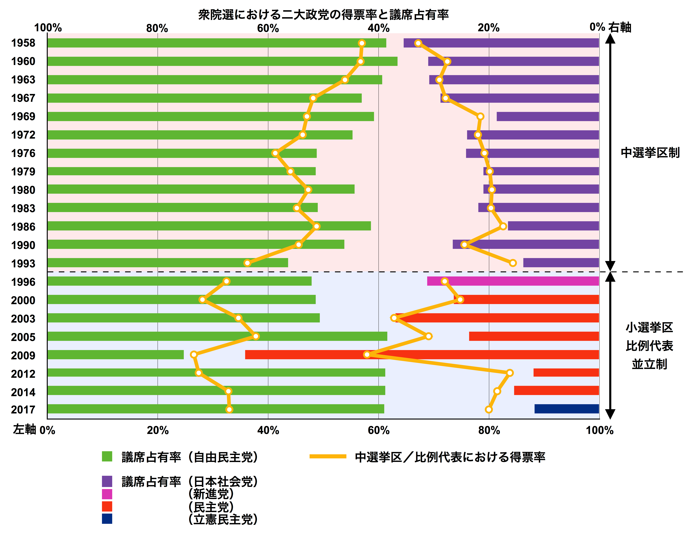
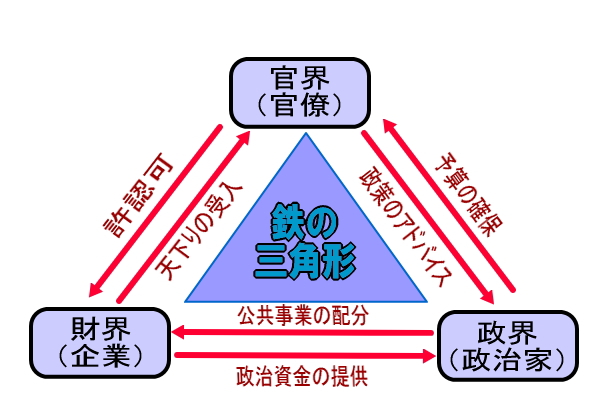
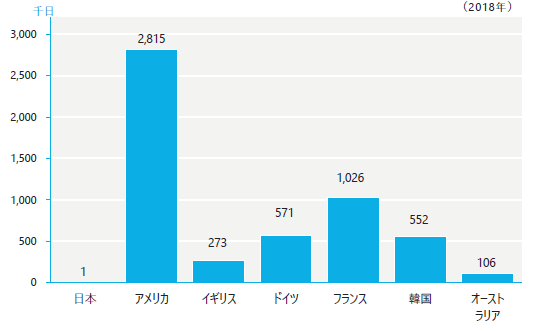

# 日本企業の経営システム {#japan}

```{r , echo = FALSE, warning = FALSE}
library(kableExtra)
library(vembedr)
```

- 本章の構成は、以下のとおりです。

  - \@ref(japan-external)では、日本企業の経営システムの外部要因として、\@ref(japan-culture)文化、\@ref(japan-politics)政治システム・法制度、\@ref(japan-economy)経済システムを整理します。
  
  - \@ref(japan-manager)では、日本企業の経営者の特徴として、\@ref(japan-selection)選抜・移動、\@ref(japan-payment)報酬、\@ref(japan-education)教育を整理します。
  
  - \@ref(japan-management)では、日本企業の経営プロセスを\@ref(japan-plan)計画、\@ref(japan-organization)組織化、\@ref(japan-command)指揮・調整、\@ref(japan-control)統制を整理します。
  
  
## 日本の文化・政治・経済 {#japan-external}

- 本節では、日本企業経営の外部要因として、日本の文化・政治・経済を確認します。

  - まず、経営学の源流として、[文化](#japan-culture)を整理します。

  - 次に、[政治システム・法制度](#japan-politics)を整理します。

  - 最後に、[経済システム](#japan-economy)を整理します。

### 文化 {#japan-culture}

#### 仏教の影響

- 日本には神道がありましたが、6世紀に儒教や仏教が伝来します。

  - 儒教は中国から、仏教はインドから中国に伝来したものが日本に伝えられましたが、日本人は国情に合わせて取捨選択し、それぞれを融合させたといえます。

- 仏教も奈良仏教（華厳宗など）、平安仏教（真言宗、天台宗）、鎌倉（新）仏教（浄土宗、浄土真宗、日蓮宗など）というように、時代によって特徴があります。

  - 奈良仏教が鎮護国家仏教、平安仏教が貴族仏教の側面が強かったのに対し、鎌倉（新）仏教は庶民の仏教という側面がありました。
  
  - 鎌倉（新）仏教は厳しい修業を必要としない「易行（念仏、坐禅など）」が特徴です。これによって、庶民でも「救われる」とされました。

- 寺西（2018, p.68）は以下のように、日本型資本主義における鎌倉新仏教の易行化の意義を論じています。

>人々は日常生活を規律正しく送り、職場や家庭において日々念仏を唱えながら、悟りを得るために自分の職業生活や日々の日常生活を充実させることに心を砕くことになった。このことが、それぞれの職業などの勤めを悟りへの道として精進するという職業的求道主義をもたらした

- 特定の価値観に合わせて社会システム（政治・経済）が一度形成されると、人々は行動をそれに適合させようとします。時代が流れて価値観が薄れたとしても、社会システムは簡単には変化しません（寺西（2018, p.14））。

  - 西洋におけるWeber(1905)の「プロテスタンティズムの倫理が、近代資本主義の成立について精神的側面から影響を及ぼした」との比較で、理解できます。（[アメリカ文化の「歴史」](#us-culture)）
  
  - 日本は自らに課した目標に向かって「道を極めていく」という傾向が顕著なため、世界的にみても男性性の高い国ですが、この易行化による職業的求道主義（一芸に秀でる）と関係していると理解できます。（ [Hofstedeの国民文化比較の「女性性⇔男性性」](#hofstede)）


#### 儒教の影響

- 儒教が日本に伝来したのは仏教よりも古いとされますが、その後仏教が盛んになったことから、儒教はあまり盛んではありませんでした（遠山（2015））。

  - 江戸時代になると、「朱子学」が幕府によって封建支配秩序（幕藩体制や士農工商）の安定のための思想として採用されました。また「陽明学」は、近江商法など商人の世界に大きな影響を与えました。
  
  - 明治時代に入ると、教育勅語など儒教の忠孝思想が取り入れられ､奨励されました。戦後、学校教育から儒教思想は姿を消し、国語の漢文において教材として利用されています。

- 儒教的価値観は中国や韓国と共通するものですが、日本人が歴史の中で取捨選択して（解釈して）きたものなので、全く同じものではない点には注意が必要です。すなわち、Hofstedeの指標にも違いがあります。

- 儒教的価値観には、集団主義、序列、秩序、法への順守、権力への服従、調和の重視、教育への敬意などがあります。

  - 序列意識が強く、組織の格付・ランキングを気にします。東大・京大を頂点とする偏差値ランキングが最たるものです。また、大企業が中小企業よりステータスが高い傾向があります。
  
    - 学歴が重視されるため、受験勉強激しく、小さい頃から学習塾に通います。有名大学が有名企業への就職につながると考えられています。企業も成績や専攻よりも大学名を見る傾向にあります。
    
  - 集団内の他人からどう見られるかが重要で、恥を避けようと行動します[^1]。
  
    - 西洋人（キリスト教徒）は（宗教的）罪（sin）を避けようと行動します。
    
  - 問題解決時に対立（裁判）を避けようとする傾向にあります。
  
    - 集団における「関係性（relation）による強制」が機能しているといえます。（[法制度](#law)）
  
    - 国民1人あたり弁護士数は先進国で最も少ないです。

[^1]: ルース・ベネディクト（1946）『菊と刀』による指摘が有名です。関心のある人は[U-NOTE編集部 (2021)](https://u-note.me/note/47506034)を参照してください。  

#### Hofstedeの指標

- 権力格差は54で中程度、世界的にみても中間に位置します。

  - 大企業は階層主義的（高い権力格差の傾向）ですが、その一方で企業の意思決定は合意志向（低い権力格差の傾向）のため、権力格差は中程度になったと考えられます。

- 個人主義は46で中程度、世界的にみても中間に位置します。

  - 集団主義（＝個人主義の指標が低い）アジア各国と比較すると、日本は個人主義といえます。
  
    - アジア各国とは「家族優先」でない点が異なります。
    
  - 欧米各国と比較すると、日本は集団主義といえます。
  
    - 日本人の集団意識は、家族より大きい集団（企業など）で形成されています。
    
    - 大企業男性社員はほぼ終身雇用であることから、会社員は自分を（職種よりも）勤務する会社で認識しようとします。
    
    - 就職（経理、営業、マーケティング、広告担当として採用される）というより、就社（担当業務は未定のまま入社する）といえます。
    
      - アメリカでは、企業とは雇用契約を結ぶ(仕事が特定される)ことから、個人の成果が重視され、転職も多いといえます。
    
  - 企業も「系列・グループ」という形での集団が見られます。

- 山岸・ブリントン（2018, p.68）は以下のように、日本人は元来個人主義的であるとし、集団主義的行動をとるのは「周囲に合わせることが経済合理的（その方がメリットがある）であるから」と論じています。

> 日本人の多くは、自分は集団主義的ではなくどちらかといえば個人主義的だと思ってるし、集団主義的な生き方よりも個人主義的な生き方のほうが望ましいと思っている。だけど他の人たちは自分とは違って集団主義的な生き方を好ましいと思っていて、だから個人主義的な行動をとるとそうした人たちから悪く思われてしまうと思い込んでいる。

- 男性性は95と高く世界的にみても高い位置にあります。

  - 長時間労働が広く一般に見られることから、仕事中毒が男性性の高さとして表れています。
  
  - 仕事に熱心に取り組む姿勢、とくに製造業において高性能な製品を作りこむのは、職業的求道主義に由来しているといえます。
  
  - その一方で、（サービス）残業が多いのは、「雇用が保障されるのと引き換えに、会社の都合で職務・勤務時間・場所が指定される」終身雇用という働き方[^2]によるものです。

[^2]: サラリーマンと専業主婦という男女の役割分担を前提とした働き方であり、社会環境が変化した現代には適合せず各所で問題が見られます。

- 不確実性回避は92と世界的にみても高い位置にあります。

  - 安定・継続を好み、リスクや変化に不安を感じます。
  
  - 地震や台風など、自然災害（という不確実性）が多い国であるという面もあります。
  
  - 山岸・ブリントン (2010, pp.146-147)は以下のように、「集団主義的行動をとらざるをえない社会であるからで、セカンドチャンスの整備が必要である」と論じています。
  
    - 終身雇用で定年まで働くことが生涯収入の面で有利であることが多いので、転職や起業独立のハードルは高くなっています。その意味で、セカンドチャンスが少ないといえます。
    
    - 個人主義の社会では個人の能力によって信頼が得られるので、（ビジネス）ネットワークへの出入りが容易になります。（[法制度](#law)）

> 生き方と社会のあり方はやっぱり切り離せなくて、嫌われたっていいじゃないかと思えるためには、ほんとうに嫌われても困らないような環境が必要。つまりセカンドチャンスがないとダメ。ぼくが言いたいのは、いろんなオプションがないと、ともかくリスクを避けようというふうにしか行動できない。人間関係にしても、仕事や他のことを決定することに関してもそうだと思う。

- 長期指向は88と世界的にみても高い位置にあります。

  - 長期的関係を重視するのは、集団から離れて行動することが不利になる社会であると解釈できます。

  - ビジネスの面では、一度信頼を得て長期的関係ができると、その後の取引がスムーズになる（再度交渉する必要がない）というメリットがあります。
  
    - アメリカ人は取引の都度交渉する必要があるので、初対面の相手と素早く関係を構築するスキルを身につけているといえます。（[Hofstedeの国民文化比較の「長期志向」](#hofstede)）

- 充足（抑制）志向は42で、やや抑制的な傾向があります。

  - 感情（喜び、悲しみ）は人前で出さない（方がいいと考える）傾向があります。

- 日本は世界で最も高文脈な社会です。（Meyer. (2014, 日本語版 p.59)）

  - 国民は文化の共通性が高いため、共有する文脈が多いです。

  - 相手に「察してもらう」ことでコミュニケーションをとるときがあります。


### 政治システム・法制度 {#japan-politics}

- 1955年に日本民主党と自由党が合同し、自由民主党（自民党）が誕生し約2/3の議席を、その他の政党が1/3を占めるようになりました（図\@ref(fig:jpparty)参照）。これを「55年体制」といいます。 　

  - 選挙の結果、民主主義国家だが、（事実上の）一党の長期政権となっています。　

- 首相や議会の力は他国よりも弱く、官僚が強い力を持っています。

  - 法案はほとんどを官僚が作成し、議員立法[^3]は少ないです。

  - 官僚は所属する省庁単位で物事を考える「縦割り行政」と批判されることがあり、安倍政権では「官邸主導」として、その弊害をなくそうとしました。

[^3]: 英語で議員はlawmakerといいます。

```{r jpparty, echo = FALSE, out.width="960px", fig.cap="衆議院における二大政党の得票率・議席占有率"}

```

出所）[Wikipedia](https://ja.wikipedia.org/wiki/55%E5%B9%B4%E4%BD%93%E5%88%B6)

- 政府（≒自民党）、官僚、財界（経団連等）が、政策の（事前）調整を行う構造を「政官財トライアングル」といいます。（図\@ref(fig:triangle)参照）

  - 官僚、財界は人の入れ替わりがあっても、組織は永続的です。政府は政権交代があるため本来永続的ではありませんが、自民党の長期政権であったため、官僚、財界とともに長期的な関係を築くことができました[^4]。
  
  - 政府、官僚、財界はそれぞれ「持ちつ持たれつ」の関係です。
  
    - 企業は同じ産業の企業が集まり、業界団体を構成します。
    
    - 省庁には局（企業の部に相当）やその下に課が存在し、産業ごとに担当する部署を原課・原局といいます。
    
    - 自民党にも産業ごとに政策部会があり、「族議員」と呼ばれます。
    
  ― 政府は永田町、官僚は霞が関、企業は丸の内・大手町にあり、すぐに会える距離にあります。

```{r triangle, echo = FALSE, out.width="960px", fig.cap="政官財トライアングル"}

```

出所）[政治経済塾 (2017)](https://www.seijikeizaijuku.com/naikaku.html)

[^4]: 「政官財トライアングル」の是非はさておき、政権交代によりこの「政官財トライアングル」は一時機能停止したといえます。　

- 契約書は「最低限のことだけ決めておいて、それ以外（想定外のこと）は互いが協調して話し合いで決めよう」と、簡潔に記載されることが多いです。

  - 最後の方の条項で、「本契約の規定に関する疑義又はこれらの規定に定めのない事項については、甲乙誠意をもって協議の上、解決するものとする。」のような条文が付いている場合が多くあります。

  - このような条項を「誠実協議条項」[^5]といいます。法的には意味がないと考えられるのですが、法制度だけでなく関係性による強制力が機能する長期的関係が背景にあることを示唆する項目といえます。

[^5]: 関心のある人は[総務の森 (2010)](https://www.soumunomori.com/column/article/atc-115077/)を参照してください。  

### 経済システム {#japan-economy}

- 日本の経済システムは、政府主導型でした。

  - 政官財トライアングルで調整された政策によって、（繊維産業や電機産業など時代によって変化させた）ターゲット産業を中心に経済成長を図るものです。
  
  - 政府（経済企画庁）が策定した計画にもとづき、通商産業省（現在の経済産業省）が各産業の振興（また円滑な縮小）を目的に策定する政策を**産業政策**といいます[^6]。
  
  - 産業政策には（関税など）保護貿易、研究開発等への補助金、資金調達の援助などが含まれます。

[^6]: 財政政策や金融政策が経済全体に影響を及ぼすのに対し、産業政策は特定の産業にのみ影響を与えるものです。

- 日本企業の特徴は「系列[^7]」です。日本の高い長期志向（長期的関係）の典型例です。

  - 系列は、個々の企業は独立しているものの、緊密な関係（資本、人事、技術、取引）にある企業群を指します。
  
  - 市場経済の（独立した）各企業よりも近い関係にあるが、単一の企業よりも緩やかな関係です。
  
- 系列には水平的系列と垂直的系列の2種類があります。

  - 水平的系列は、多角化した（戦前の）財閥系（三菱、三井、住友等）企業が、戦後に銀行を中心にまとまったものです。（図\@ref(fig:mitsubishi)参照）
  
  - グループ内の銀行が融資を行う、グループ企業が相互に株式を持ち合って買収を妨げる、毎月社長が会合を持って情報交換するといった特徴があります。


```{r mitsubishi, echo = FALSE, out.width="960px", fig.cap="三菱財閥と三菱グループ"}
knitr::include_graphics("https://liberal-arts-guide.com/wp-content/uploads/2020/09/Corporate-group-1.jpg")
```

出所）[リベラルアーツガイド (2020)](https://liberal-arts-guide.com/corporate-group/)

注）元資料は、菊池浩之（2017）『三井・三菱・住友・芙蓉・三和・一勧　日本の六大企業集団』KADOKAWA 23頁

```{r bigsix, echo = FALSE, out.width="960px", fig.cap="六大企業集団の社長会"}
knitr::include_graphics("https://www.jftc.go.jp/info/nenpou/h06/Img/02070001.gif")
```

出所）[公正取引委員会 (1995)](https://www.jftc.go.jp/info/nenpou/h06/02070002.html)
  
```{r bigsix2, echo = FALSE, out.width="960px", fig.cap="六大企業集団の株式持ち合い"}
knitr::include_graphics("https://www.jftc.go.jp/info/nenpou/h10/Img/02070006.gif")
```

出所）[公正取引委員会 (1999)](https://www.jftc.go.jp/info/nenpou/h10/02070001.html)
 
- 垂直的系列は、大企業が部品を供給する関係会社をまとめた（日立、松下→パナソニック、トヨタ等）ものです。

  - 親会社が子会社を、子会社が孫会社の株式を保有する構造になります。
  
  - 水平的系列の各企業も垂直的系列をもっています（例：三菱重工業が三菱重工業グループを形成）。

  - 日立製作所のCMは日立グループの紹介になっています。

```{r hitachi, echo = FALSE, warning = FALSE, out.width="640px", fig.cap="日立製作所CM"}

embed_url("https://youtu.be/q8SQNMclNGY")
```


[^7]: 系列といった企業集団は英語圏にないため、keiretsuと英語になっています。[ロングマン現代英英辞典](https://www.ldoceonline.com/jp/dictionary/keiretsu)

- 日本経済は、効率的な部門と非効率な部門が存在する二重構造になっています。

  - 国内向けサービス業（通信・小売・金融）や農業が非効率で国際競争力が低い一方で、輸出向け製造業（自動車、電機、機械）は国際競争力が高く、世界的大企業もあります。
  
- バブル経済の絶頂期には日本企業は銀行業が巨大化し世界時価総額ランキングの上位を多く占めていましたが、現在では上位50社にトヨタ自動車がランクされるのみです。（図\@ref(fig:value)参照）

```{r value, echo = FALSE, out.width="960px", fig.cap="グローバル時価総額ランキングー平成元年と平成31年ー"}
knitr::include_graphics("https://media.startup-db.com/wp/wp-content/uploads/2019/07/1-min-1.png")
```

出所）[STARTUP DB (2019)](https://media.startup-db.com/research/marketcap-global)
 
- 労働組合は企業別労働組合で、労使がよく協調する点が特徴です。

  - 戦後、労働運動が激しい時期がありましたが、1970年代以降激しい対立は少なくなりました。
  
  - 労働争議で失われる時間は先進国のなかで最少となっています。（図\@ref(fig:strike)参照）

```{r strike, echo = FALSE, out.width="960px", fig.cap="労働争議による労働損失日数"}

```

出所）[労働政策研究・研修機構 (2019, p.264)](https://www.jil.go.jp/kokunai/statistics/databook/2019/07/d2019_G7-2.pdf)


<span style="font-size: 150%">**参考文献**</span>

Meyer, E. (2014). The Culture Map: Breaking Through the Invisible Boundaries of Global Business. PublicAffairs.（日本語版　樋口武志（訳）・田岡恵（監訳）(2015)『異文化理解力』英治出版.）

[STARTUP DB (2019)「平成最後の時価総額ランキング。日本と世界その差を生んだ30年とは？」](https://media.startup-db.com/research/marketcap-global)

Weber, Max (1905). Die protestantische Ethik und der Geist des Kapitalismus. （日本語版　大塚久雄（訳）(1989)『プロテスタンティズムの倫理と資本主義の精神』岩波文庫.）

[U-NOTE編集部 (2021) 「どちらが美徳？日本人に根づく「恥の文化」と諸外国の「罪の文化」」](https://u-note.me/note/47506034)

[Wikipedia「55年体制」](https://ja.wikipedia.org/wiki/55%E5%B9%B4%E4%BD%93%E5%88%B6)

[公正取引委員会 (1995)『平成6年度　公正取引委員会年次報告』](https://www.jftc.go.jp/info/nenpou/h06/02070002.html)

[公正取引委員会 (1999)『平成10年度　公正取引委員会年次報告』](https://www.jftc.go.jp/info/nenpou/h10/02070001.html)

[政治経済塾 (2017)「６時間目：内閣」](https://www.seijikeizaijuku.com/naikaku.html)

[総務の森 (2010) 「契約書の基礎知識　誠実協議条項とは」 ](https://www.soumunomori.com/column/article/atc-115077/)

寺西重郎 (2018)『日本型資本主義』中公新書2502.

[遠山茂 (2015)「儒教思想の日本への影響」在青島日本国総領事館](https://www.qingdao.cn.emb-japan.go.jp/jp/publicrelations/index_150917.html)

山岸俊男・ブリントン，メアリー・Ｃ (2010)『リスクに背を向ける日本人』講談社現代新書2073.

[リベラルアーツガイド (2020)「【企業集団とは】意味から財閥との違いまでわかりやすく解説」](https://liberal-arts-guide.com/corporate-group/)

[労働政策研究・研修機構 (2019)『データブック国際労働比較2019』](https://www.jil.go.jp/kokunai/statistics/databook/2019/index.html)


## 日本企業の経営者 {#japan-manager}

- 本節では、日本企業の経営者に関連する項目を整理します。

  - まず、日本企業の経営者のキャリア形成のプロセス、[選抜・移動](#japan-selection)を整理します。

  - 次に、日本企業の経営者の[報酬](#japan-payment)について、概要を整理します。

  - 最後に、日本企業の経営者の教育的背景（学歴）や、経営学の[教育](#japan-education)の位置付けについて整理します。


### 選抜・移動 {#japan-selection}

- [Strategy& (2019)](https://www.strategyand.pwc.com/jp/ja/publications/2018_ceo-data-media-release-jp.pdf)が行った、世界の上場企業における時価総額の上位2,500社を対象にした調査によると、日本企業の経営者（最高経営責任者CEO:Chief Executive Officer）の平均像は、以下の通りです。 [アメリカ](#us-selection) [アジア](#asia-selection)

  - 2018年に就任したCEOの年齢の中央値は60才です。
  
    - Edfelt (2010, pp.240-241)によると、日本企業は以下の特徴があります。
    
      - 50代で常務になり、（専務を経て）社長に就任するのは平均で59才
      
      - 社長として6.3年経営し、その後2/3が会長になる

      - 業績不振によって退任を強いられることは少ない
  
  - 内部昇格したCEOが97%で、外部招聘のCEOが3%でした。
  
    - 新任CEOの18%が他企業での職務経験があります。
    
  - 海外での勤務経験を有するCEOは21%でした。
　
    - 世界平均レベル（33%）に比べると低い水準です。
    
  - 新任CEOの100%が日本国籍でした。

  - 新任CEOの女性比率は0%でした。
  
    - デロイトトーマツグループと三井住友信託銀行とによる上場企業970社を対象にした調査（2021年）によると、「取締役に女性・外国人とも登用していない企業は48%、女性取締役がゼロは51%だった。2020年の調査（902社）でそれぞれ57%、60%だったのに比べて女性・外国人の登用が進んだものの、なお半数の企業の取締役会が日本人男性のみで運営」されていました[^8]。
　
    -  [帝国データバンク (2021)](https://www.tdb.co.jp/report/watching/press/p210805.html)によると、日本企業の女性管理職（注：CEOではない）の平均割合は過去最高となったものの 8.9％にとどまりました。

    - 政府は2003年に「**2020年**までに女性管理職の割合を30%に」との期限付き目標を掲げましたが、実現が見通せず、2020年12月に「2020年代の可能な限り早期に」と改めています[^9]。

[^8]:日本経済新聞朝刊 2021年11月21日「女性・外国人取締役、主要企業の半数でゼロ」

[^9]:[日本経済新聞電子版 2021年5月15日「女性の管理職比率とは　米欧先行、日本は10%台」](https://www.nikkei.com/article/DGXZQOCC1454K0U1A510C2000000/)

  - 新任CEOの0%がMBA（経営学修士）保有者です。
  
    - 世界平均(33%)を大きく下回ります。
    
    - 理系出身は大学院修了（修士）も一般的ですが、文系出身は大学卒業[^10]が多いです。

[^10]:CEOの学歴として、「大卒」は国際的には低学歴といえます。  

  - 高級官僚は退職する際に所管する業界の企業に再就職し、「政官財トライアングル」の連絡係として機能しました。
  
    - この再就職は「天下り」と呼ばれますが、現在、「天下り」は法律で禁止されています。

- 移動の少なさは、終身雇用によって転職が経済的に不利であることや（そのために）不確実性回避が高くなっていることから解釈できます。

- 小熊 (2019, p.6)は、経団連[^11]正副会長のプロフィール（表\@ref(tab:keidanren)）を参考にして、本節で述べた日本企業の特徴を以下の通りまとめています。

[^11]:経団連については、[マイナビ (2020) "「経団連」とは？ 今さら聞けないその言葉の意味・役割・取り組みを解説"](https://gakumado.mynavi.jp/style/articles/46464)などを参考にしてください。

>1. まず、学歴が重要な指標となっている。ただし重要なのは学校名であり、何を学んだかではない。  
2. つぎに、年齢や勤続年数が、重要な指標となっている。ただしそれは、1つの企業での勤続年数であって、他の企業での職業経験は評価されない。  
3. その結果、都市と地方という対立が生じる。何を学んだかが重要なら、必ずしも首都圏の有名大学である必要はない。  
4. そして、女性と外国人が不利になる。女性は結婚と出産で、勤続年数が中断されがちだ。また他国企業での職業経験が評価されないなら、外国人は入りにくい。

```{r keidanren, echo = FALSE, fig.align="center"}
keidanren <- read.csv("keidanren.csv", header = TRUE)
knitr::kable(keidanren, caption = "日本経団連正副会長19名（2018年6月）のプロフィール", booktabs = FALSE) %>% column_spec(1:2, width = "6em") %>% column_spec(4:7, width = "6em")
```

出所）日本経済新聞[^12]、日本産業新聞[^13]

[^12]:日本経済新聞朝刊 2018年6月18日「変わる経団連、変われぬ経団連」  
[^13]:日経産業新聞 2018年6月22日「経団連　この恐るべき同質集団」

- 学歴重視の結果、日本企業の経営者は同質性が高く、ダイバーシティの面で遅れていると指摘されています。


### 報酬 {#japan-payment}

- \@ref(us-payment)で見たとおり、日本企業CEOの報酬（2020年度）の中央値は1.8億円でした。

- [東洋経済新報社 (2021)](https://toyokeizai.net/articles/-/453483)によれば、2億円以上の報酬は212人いました。

  - 外国人のCEOは少ないですが、役員は多く見られるようになりました。

  - 業績連動ボーナスを実施する企業は少ないですが、増えつつあります[^14]。
  
[^14]: 日本経済新聞朝刊 2020年7月19日「社長の報酬、日米で格差12倍に　19年度　業績連動部分少なく」によると、自社の現物株を報酬として付与する企業が、2020年6月末時点で800社超と過去1年間で5割増えまし
た。日本では報酬全体の57%が固定給ですが、アメリカではわずか9%です。

- [東洋経済新報社 (2020)](https://toyokeizai.net/articles/-/397196)によると、ペイレシオが高い企業3社は武田薬品工業55.67倍、ユニバーサルエンターテイメント47.66倍、ソフトバンク43.35倍となっています。

  - ペイレシオは先進国で最も低いです。

- 日本企業は終身雇用かつ年功賃金のため、転職が少ないです。

  - 年功賃金では、仕事の貢献度と受け取る賃金が異なるため、中途退社が不利な賃金体系となります（図\@ref(fig:jpwage)参照）。
  
  - 年功賃金は海外にもありますが、日本はその傾向が強いです（図\@ref(fig:wages)参照）。
  
```{r jpwage, echo = FALSE, out.width="960px", fig.cap="「賃金カーブ」と「貢献度曲線」の関係"}
knitr::include_graphics("https://www.hj.sanno.ac.jp/cp/feature/img/20191224-01/20191224-01-01.jpg")
```

出所）[産業能率大学総合研究所 (2021)](https://www.hj.sanno.ac.jp/cp/feature/201912/24-01.html)

```{r wages, echo = FALSE, out.width="960px", fig.cap="賃金カーブの国際比較"}
knitr::include_graphics("https://article-image-ix.nikkei.com/https%3A%2F%2Fimgix-proxy.n8s.jp%2FDSXKZO4688323002072019EA2000-2.jpg?ixlib=js-2.3.2&w=680&h=414&auto=format%2Ccompress&ch=Width%2CDPR&q=100&fit=crop&bg=FFFFFF&s=82f886b70681be033aa0e059009b558b")
```

出所）[日本経済新聞電子版 2019年7月3日「年功序列型の賃金とは　日本型経営「三種の神器」」](https://www.nikkei.com/article/DGXKZO46883220S9A700C1EA2000/)


### 教育 {#japan-education}

- 大企業・政府は有名大学から新規学卒者を大量に採用します。

  - 受験によって選抜が済んでいると考えています。
  
  - 個人の資質（責任感、規律等）を重視し、大学の専攻はさほど重要視しません。

  - 小熊 (2019)は、上掲の日経新聞記事が「卒業した大学名は詳細に記されているが、学部や専攻については何も述べていない」ことを指摘し、日本社会は「何を学んだかが重要でない学歴[^15]重視」であるとしています。

[^15]:冨山和彦氏は対談の中で「そうですね。合格歴ですよね。濁点が違っています。「高学歴」じゃなくて「合格歴主義」(笑)。」といっています。[小野・冨山 (2020) ](https://gendai.ismedia.jp/articles/-/71570?page=5)

<!---
https://blogos.com/article/460720/
--->

- 「仕事」をきちんと決めておいてそれに「人」を当てはめるやり方の欧米諸国に対し、「人」を中心に管理が行われ、「人」と「仕事」の結びつきはできるだけ自由に変えられるようにしておくのが日本の特徴です（濱口 (2013, p.35)）。

  - そこで求められるのは、「いかなる職務をも遂行しうる潜在能力」となります。
  
  - 企業は採用に当たって「新規学卒者の「能力」の代理指標としてその学歴水準、それもどのランクの大学に入れたか（中略）という指標を採用（濱口 (2013, p.126)）」します。
  
  - 情報の経済学におけるシグナリングという概念を使うと、学歴重視には合理性があるとされます。

- 大卒の1/5は経済・商学系（アメリカと同様）です。
  
  - しかし（生産）現場を重視し、学問としての経営学を重視しない傾向があります。

- 経済・商学系学部卒の16人に1人がビジネススクールに進学します（Edfelt (2010, p.242)）。

  - ただし、MBAが出世や昇給の近道となっていません。
  
  - むしろ、文系で修士号や博士号を取得していると、逆に出世しにくい面があります。「ムラ社会だと修士号や博士号を持っていると「異端」に位置づけられて、「本流」から外されてしまうわけです（[小野・冨山 (2020)](https://gendai.ismedia.jp/articles/-/71570?page=5)）」

- 社内教育は充実しています。

  - 濱口 (2013, p.97)は、その理由を次のように説明しています。

>「人」が先にあり、その人にすぐにできるとは限らない「仕事」を当てはめるというやり方ですから、その「仕事」のやり方を社内で学ぶという仕組みがなければ、うまく回っていきません。つまり、仕事に関する教育訓練の仕組みが、社内教育訓練中心の仕組みにならざるを得ないということです。

  - 日本では企業が事業構造を変化させるのに伴って、従業員を再教育し成長職種に配置転換させます[^16]。労働者が自ら大学（院）でスキルを学び転職するアメリカとは対照的です。
  
[^16]:日本経済新聞朝刊 2021年7月7日「工場従業員にDX教育 キヤノン 成長職種へ配置転換」

<span style="font-size: 150%">**参考文献**</span>

Edfelt, Ralph B. (2010). Global Comparative Management. SAGE.

[Strategy& (2019)「2018年 CEO 承継調査」](https://www.strategyand.pwc.com/jp/ja/publications/2018_ceo-data-media-release-jp.pdf)

小熊英二 (2019)『日本社会のしくみ』講談社現代新書2528.

[小野一起・冨山和彦 (2020) 「日本企業で出世する人たち、じつは「超低学歴」ばかりになっていた…！」マネー現代](https://gendai.ismedia.jp/articles/-/71570?imp=0)

[産業能率大学総合研究所 (2021) 「賃金を切り口とした年功序列型人事制度の検証」](https://www.hj.sanno.ac.jp/cp/feature/201912/24-01.html)

[帝国データバンク (2021)「女性登用に対する企業の意識調査（2021年）」](https://www.tdb.co.jp/report/watching/press/pdf/p210805.pdf)

[東洋経済新報社 (2020)「社員と役員の｢年収格差｣ランキングTOP500」東洋経済ONLINE](https://toyokeizai.net/articles/-/397196)

[東洋経済新報社 (2021)「｢年収1億円超｣の上場企業役員ランキングTOP500」東洋経済ONLINE](https://toyokeizai.net/articles/-/453483)

濱口桂一郎 (2013)『若者と労働』中公新書ラクレ465.

## 日本企業のマネジメント {#japan-management}

- 本節では、日本企業のマネジメントに関連する項目を整理します。

  - まず、日本企業の[計画](#japan-plan)を整理します。

  - 次に、日本企業の[組織化](#japan-organization)について、概要を整理します。

  - 次に、日本企業の[指揮・調整](#japan-command)について、概要を整理します。

  - 最後に、日本企業の[統制](#japan-control)について、概要を整理します。

### 計画 {#japan-plan}

- 日本企業は欧米企業と比べ長期計画は厳密でない一方、経営理念が強く働いています。

  - 経営者の任期が長くないため、（任期を超える）長期計画を策定するよりも、創業者の経営理念（ビジョン）で経営の方向性を示しています。
  
  - 短期・中期計画では、綿密な計画を立てます。

- 欧米企業よりも、海外の動向に関する情報収集に熱心だとされています。

  - 旧財閥系の水平的系列では、総合商社を始めとしてグループ各社が国内外で収集した情報を社長会（図\@ref(fig:bigsix)参照）を通じて共有します。
  
  - 日本貿易振興会（JETRO）は、国際経済の調査や市場動向に関する情報を収集しています。中小企業は日本貿易振興会（JETRO）を通じてこれらの情報を入手でき、また海外進出について相談することができます。

- 長期計画がないことや情報収集に熱心という特徴は、日本企業の強みにも関連します。

  - とくに高度経済成長期の日本製品は、欧米先進国の模倣でした。独特な製品や戦略がある企業は例外でした。
  
  - 日本製品が競争力を持ったのは、絶え間ないカイゼン[^17][^18]（コスト削減・品質向上）、柔軟な生産体制、市場化への時間短縮によるものです。
  
  - つまり、差別化を生み出す戦略・長期計画よりも、海外市場動向（新製品）の情報収集や、コスト削減・品質向上を実現する短期の生産・販売計画に重心が置かれていました。

[^17]: カイゼン（改善）といった企業内活動は英語圏にないため、kaizenと英語になっています。[ロングマン現代英英辞典](https://www.ldoceonline.com/jp/dictionary/kaizen)

[^18]:カイゼンについては、[岡内 (2017)](https://toyokeizai.net/articles/-/202227)などを参考にしてください。

### 組織化 {#japan-organization}

- 日本の大企業の多くは事業部制をとっています。事業部を分社化し、経営本部が持株会社（〇〇ホールディングス）として子会社を統括する形態も増えています。

- 日本企業の組織の特徴は、その柔軟性です。

  - 欧米のように「職務記述書」で「仕事」の内容、範囲、責任、権限などが規定されておらず、入社後数年ごとに人事ローテーションが行われます。
  
  - この人事ローテーションによって、社員誰もが複数の経験・スキルを身につけるようになります。製造現場で複数の工程を担当できる工員を「多能工」と呼びます。
  
  - 複数の経験・スキルを身につけていることから、社員は組織を越えて協力することができ、これが日本企業の強みにつながっています。
  
  - 協力の一方で責任も分担されるといったデメリットも生じます。

    - 柔軟な組織では役割分担が曖昧なため、「共同責任は無責任」となりがちです。

- 垂直的系列におけるグループ各社は別法人ですが、グループ本社によって人事・財務・生産・技術の各分野で（あたかも1つの企業のように）調整が行われます。

  - グループ本社と各系列会社は技術面で綿密な連携をとり、共同で技術開発を行います。

  - グループ本社の売上が下がると、系列企業同士で取引価格の調整（という値下げ要求）が行われます。

- 多角化は親会社の部門独立が多く、M&Aによる新規事業進出は少ないです。

  - 技術進歩のスピードが速いIT業界を中心に、M&Aによる新規事業進出も増えつつあります。

### 指揮・調整 {#japan-command}

- 日本の特徴は、権力格差と個人主義が中程度であるということです。

  - 欧米企業に比べ意思決定は中央（経営陣）に集中しがちで、権限移譲は進んでいません。
  
    - 海外現地法人の経営も日本人であることが多く、かつ日本の本社の判断を仰ぐことがあります。
    
  - その一方で、意思決定においては幅広く意見を聞き、組織内メンバーの合意を求める傾向があります。
  
    - 会議の前には「根回し」と呼ばれる事前の打ち合わせが行われ、会議参加メンバーの意見が調整されます。よって会議において議論はほとんどなく、調整済みの案が承認されるだけです。
    
    - スケジュール調整の手間を省くため、会議を開くことなく、稟議書の回覧を通して関係者全員の承認を得ることがしばしば行われます。

    - 根回しや稟議といった合議制は、意思決定後は各部署所の協力がスムーズに得られるといったメリットがある一方、意思決定に時間がかかるというデメリットがあります。

  - 階層主義と合意志向の決定の組み合わせは、世界的にも例外的です（[「Meyerのカルチャーマップ」の"リード"と"決断"](#meyer)）。
  
- 

- 次の特徴は、高文脈社会のため個人間のコミュニケーションが間接・暗黙的だということです。

  - 社会的、文化的に同質的な日本人は、しぐさ・表情から多くを読み取ります。
  
  - （とくに相手が気分悪くするような内容は）体面を保つように表現します。
  
    - 交渉時でも「NO」と言わないなどの不明瞭な意思表示によって、低文脈社会の人とのコミュニケーションではしばしば混乱が生じます。
  
  - 沈黙もコミュニケーションの手段となります。
  
    - 相手の会話にすぐには反応しない（沈黙する）と、日本人は「よく考えて対応している」と思う一方で、アメリカ人は「この人は質問の答えを知らないのか、質問の仕方が悪かったのかもしれない、あるいはなにか偽ろうとしている」と考えます[^19]。
    
  - 低文脈社会では文書でのコミュニケーションが必須なためメモが重要となりますが、それと比較すると日本では口頭での連絡が多い[^20]とされています。


[^19]:沈黙については、[Gigazine (2021)](https://gigazine.net/news/20210723-cultural-implications-silence/)などを参考にしてください。
　
[^20]:メールやチャットの普及により、日本でも口頭連絡は減ってきました。

　
利益追求（だけ）の主体ではなく、雇用を確保し社員の生活を向上させることを基本的目的としている
　集団意識

モチベーションは世界的にみて高い水準
社員も仕事を自分の労働力の販売とは考えない
恥の文化
恥を避けようとし、周囲を失望させないようにする
残業
早く帰ると仕事に熱心でないようにみえる
高い男性主義
報酬
職位や生産性でなく年功で決まる（最初の10-20年）、社宅、福利厚生、住宅購入補助のほか、結婚支援もある
ほめられることが苦手
お世辞と聞こえ、それが不信につながることもある→減点主義が多い（できないことを注意する）
高い不確実性回避
日本的リーダー
合意形成者
必要な資質：公正さ、寛大さ、慎重さ、冷静さ
合意形成システム
各人に拒否権が与えられている
和をみださないフォロアーシップがより重要
リスクを取りにくい


非言語的コミュニケーション


### 統制 {#japan-control}

1. 外部統制
業績不振で株価・負債格付けが低下
敵対的買収（による経営者解任）のリスクが高まる
新規資金調達にコストが余分にかかる
日本の特徴
株式市場からの統制は弱い
←系列企業間の「株式持ち合い」による買収防止

　株式持ち合い
買収に対する意識
よく思わない文化（買い手：乗っ取り、売り手：社員（＝家族）を売る）
→1991年0.4％が最近3％に上昇（英米10％）

2. 内部統制
経営の優先順位
社員、年金受給者（OB）、取引先、銀行、株主
取締役会による統制も効きにくい
利益率が低く、企業価値（＝株式市場による評価）も低い
人事
終身雇用のため重要かつ慎重
→人事部長が役員になることがある（欧米ではまれ）

(1)　取締役会

(2)　原価低減
生産面での統制
カンバン（Just-In-Time）方式→取引先との連絡を緊密にして、品質と納期を保証する、
カイゼン→デザインや生産方式の継続的改善活動
営業面での統制
目標の市場シェア→販売価格→コスト（削減）
日本的経営　アベグレン

<span style="font-size: 150%">**参考文献**</span>

Hall, Edward T. (1977). Beyond culture. Anchor Books.（岩田慶治・谷泰（訳）(1993)『文化を超えて　新装版』阪急コミュニケーションズ.）

Hofstede, G, G. J. Hofstede, and M. Minkov (2010). Cultures and Organizations: Software of the Mind, Third Edition. McGraw-Hill Education.（日本語版　岩井八郎・岩井紀子（訳）(2013)『多文化世界　違いを学び未来への道を探る　原書第3版』有斐閣.）

[Gigazine (2021)「「沈黙」の意味は文化によって違う、さまざまな文化における沈黙の使い方とは？」(https://gigazine.net/news/20210723-cultural-implications-silence/)

Meyer, E. (2014). The Culture Map: Breaking Through the Invisible Boundaries of Global Business. PublicAffairs.（日本語版　樋口武志（訳）・田岡恵（監訳）(2015)『異文化理解力』英治出版.）


[岡内彩 (2017)「意外と知らない､トヨタの｢カイゼン｣の本質」東洋経済ONLINE](https://toyokeizai.net/articles/-/202227)
