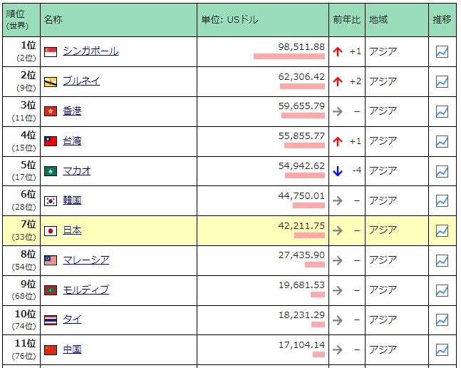

# アジア企業の経営システム {#asia}

```{r , echo = FALSE, warning = FALSE}
library(kableExtra)
library(vembedr)
```

- 本章の構成は、以下のとおりです。

  - \@ref(asia-external)では、アジア企業の経営システムの外部要因として、\@ref(asia-culture)文化、\@ref(asia-politics)政治システム・法制度、\@ref(asia-economy)経済システムを整理します。
  
  - \@ref(asia-manager)では、アジア企業の経営者の特徴として、\@ref(asia-selection)選抜・移動、\@ref(asia-payment)報酬、\@ref(asia-education)教育を整理します。
  
  - \@ref(asia-management)では、アジア企業の経営プロセスを\@ref(asia-plan)計画、\@ref(asia-organization)組織化、\@ref(asia-command)指揮・調整、\@ref(asia-control)統制を整理します。
  
  
## アジアの文化・政治・経済 {#asia-external}

- 本節では、アジア企業経営の外部要因として、アジアの文化・政治・経済を確認します。

  - まず、[文化](#asia-culture)を整理します。

  - 次に、[政治システム・法制度](#asia-politics)を整理します。

  - 最後に、[経済システム](#asia-economy)を整理します。

### 文化 {#asia-culture}

- 本講義での「アジア」とは、中国文明（特に儒教）の影響を受けた国・地域とします。

  - 中国、台湾、香港、シンガポール（75%が中国系）、および韓国、北朝鮮です。
  
- 儒教が宗教であるかどうかは議論がありますが、本講義ではその価値観とそれに基づく慣習に着目します。

  - 代表的な価値観は、秩序、序列（上下関係）を重視する点です。
  
    - 「親・子」、「夫・妻」、「年長・年少」、「支配者・市民」、「雇用者・従業員」、「教師・生徒」といった様々な場面での表われます。

- 寺西（2018, p.241）は以下のように、中国の「資本主義の精神」をまとめています。

> 知識階層を中心とする指導者階級が「理」を体現し、君子と官僚による徳治という伝統の下、一方での政府統制の容認と他方での「気」に基づく野放図な利益追求行動を生み出す傾向は、ある意味で伝統的な中国の資本主義の精神であるように思われる。

#### Hofstedeの指標

- 権力格差は中国80、韓国60、台湾58、香港68、シンガポール74と総じて高く、世界的にみても高いグループに位置します。

  - 権力格差の高さは、儒教の「五倫（父子の親、君臣の義、夫婦の別、長幼の序、朋友の信）」に基づいています。（Edfelt (2010, p.190)、（Meyer (2014, 日本語版 pp.164-165)））
  
  - 学歴社会にもつながっており、受験戦争は厳しいです。大学院への進学率も高いです。

- 集団・個人主義は中国20、韓国18、台湾17、香港25、シンガポール20と総じて低く、世界的にみても集団意識の強いグループに位置します。

  - 集団意識は、主として家族（血縁関係）に基づきます。これはラテンアメリカなど集団意識の強い各地域で共通してみられる傾向です。
  
    - 日本にみられる集団意識は、必ずしも血縁関係に基づいていないところが異なります。
  
  - 縁故（コネ）がビジネスにも影響します。
  
    - 中国では「関係（guanxi）」を築き、内集団のメンバーと見做されることがビジネス上重要となります。
    
    - 家族・親族、出身地・方言、出身校の関係が、日常生活やビジネスにおける信頼につながります。そのため、取引を始める前に、まず「関係」を作る必要があります。
  
  - 企業と社員の関係は（企業オーナーの家族は別として）、薄いです。
  
    - 韓国では、これが労使対立の一因になっています。

- 男性性は中国66、韓国39、台湾45、香港57、シンガポール48と地域差があります。

  - 周囲（親・兄弟・教師・上司）の期待に応えようとします。

    - 日本のように会社（組織）のために働くということが少ないので、男性性が高くなりません。

  - 社会生活において、「恥をかかす」「面子を潰す」のは避けなければなりません。

    - 上司が部下を叱責する場合でも、個室（1対1）で行うなど、相手の体面を保つことが重要となります。

- 不確実性回避は、中国30、韓国85、台湾69、香港29、シンガポール8と地域差があります。

  - 中国は国内でも地域差があり、北部は不確実性回避の数値が高く南部は低いです。
  
  - 中国国外に住む中国人のうち中国国籍を持つ人を華僑、現地国国籍を持つ人を華人と呼びます。
  
  - 華僑・華人は中国南部出身（祖先）が多く、起業家精神が高いです。

- 長期指向は中国87、韓国100、台湾93、香港61、シンガポール72、世界的にみても高いグループに位置します。

  - 一族の繁栄を考えて行動をします。
  
  - 初対面の相手に親しく接することは少なく、時間をかけて「関係（guanxi）」を築いていきます。（Meyer (2014, 日本語版 pp.206-207)）

- 充足（抑制）志向は中国24、韓国29、台湾49、香港17、シンガポール46、世界的にみても低いグループに位置します。

  - 長期志向と関連しています。アメリカと対照的です。
  
  - 論語には「巧言令色鮮し仁（言葉や顔つきを上手くとりつくろうような人たちの中に、人格者はいない）」や「剛毅朴訥は仁に近し（意志が固くて飾り気のない人は、真の人格者に近い）」といった節があります。
  
- アジアの各国は、高文脈文化に分類されます。
  
  - ただし、日本の時間感覚がモノクロニック時間であることから、同じ高文脈社会であるアジアとは違いが存在します[^1]。
  
  - Meyer (2014, 日本語版 pp.288-290)に、日本と中国の時間に対する認識の類似点・相違点が紹介されています。

> 中国の文化では、時間に正確であることが美徳とされていて、ミーティングに遅れる場合はしっかりと謝る必要がある。ただ中国人と日本人の時間に対する認識が似ているのはここまでだ。日本人は非常にしっかりと計画を立てる。彼らは柔軟というよりは明らかに組織化されている。中国では、事前の計画がないまま、あらゆることがその場で起きる。中国人は柔軟性の最たる人々だ。明日や来週のことは考えず、今ここのことを考える文化なんだ。

> 中国人の同僚たちの働き方を見ていると、本当にただただ驚くよ。彼らは即興で計画を進めていくのに優れているんだ。（中略）前の晩に決まったことはすぐに変わる。（中略）だが結局はうまくいく。中国人は極めて柔軟なのだと一度理解すれば、自分が合わせる限りすべてうまくいく。


[^1]: [倉沢 (2017)](https://toyokeizai.net/articles/-/160021)には、日本人が同じアジア人である中国人や韓国人とビジネスをする場合に、気をつけることがまとめられています。

- 韓国は儒教の影響を受けており、中華圏と類似点が多いですが、相違点もいくつかあります。

  - 権力格差は比較的高く、上下関係に厳しい（目上の人に対しての礼節を重んじる）です。
  
    - 学歴社会であり、教育熱は東アジアで一番といわれます。
    
  - 個人主義は低く、家族意識が強いです。
  
    - 経営者が家族に占められることが多いため、社内昇進して経営者になることが少ないです。
    
      - 労使が対立しやすく、労働運動が闘争的です。
      
      - 不確実性回避の指標は高いものの、（社内昇進に限界があるため）独立して起業するケースがよくみられます。

  - キリスト教徒が多く、国民の1/4を占めます[^2]。

[^2]: アジアでキリスト教徒が多いのは、韓国とフィリピンです。


### 政治システム・法制度 {#asia-politics}

- 1945年の第2次世界大戦を経て、アジアの多くの国が日本・ヨーロッパから独立します。

  - 独立後は、権威主義的体制のリーダーのもと経済発展が図られました（表\@ref(tab:authoritarian)）。 

```{r authoritarian, echo = FALSE, fig.align="center"}
authoritarian <- read.csv("authoritarian.csv", header = TRUE)
knitr::kable(authoritarian, caption = "アジアの権威主義的体制", booktabs = FALSE)
```

- 強いリーダーシップ（独裁・専制政治）のもと推し進められた経済システムを「開発独裁」を呼びます。

  - 経済発展達成という正の部分と、独裁（非民主的政治）という負の部分の両面があると評価されます。

- 韓国と台湾では経済発展が実現した後、政治も民主化が実現します。

  - 韓国では1987年に、台湾では1996年に民主的な選挙により、国のリーダーが選出されました。
  
  - シンガポールでは権威主義的体制のリーダーが続いています。

- 社会主義国である中国は、1978年から鄧小平の主導により「改革開放」という経済政策が開始され、市場経済への移行が始まりました。

  - これを「社会主義市場経済」と呼びます。

- アジア各国の法体系は、植民地時代の宗主国の影響を大きく受けています。

  - 日本がドイツ法（シビル・ロー）の影響を受けているため、中国・台湾・韓国もその傾向があります。シンガポールはイギリス法（コモン・ロー）の影響を大きく受けています。
  
- アジアにおけるビジネスでは、関係性（relation）による強制（それがまとまったものが慣習）がより重要です。

  - 歴史的に（清まで）政府は領土が広すぎて交通・通信手段が整備できず、法の執行力が不十分でした。

    - 家族が最も信頼できる存在となります。
    
    - 関係性に基づく強制が必要であり、現在でもビジネスにおいて関係性の構築は重要です。


### 経済システム {#asia-economy}

- 「開発独裁」により経済発展を遂げたアジアの4カ国（地域）韓国、台湾、香港、シンガポールは、かつて「新興工業国（NIEs）」と呼ばれました。

  - GDPを人口で割った1人当たりGDP（購買力平価基準）は、2021年のデータでは、日本を超えています（図\@ref(fig:percapita)参照）。
  
  - 中国は経済規模（名目GDP）で世界第2位（1位アメリカ、3位日本）ですが、人口が多いため1人当たりGDPはまだ少ないです。

```{r percapita, echo = FALSE, out.width="960px", fig.cap="アジアの一人当たりの購買力平価GDP(USドル)ランキング"}

```

出所）[世界経済のネタ帳 (2021)](https://ecodb.net/ranking/area/A/imf_ppppc.html) から一部抜粋

<br>


```{r asiapercapita, echo = FALSE, warning = FALSE, out.width="640px", fig.cap="Top 20 Asian Country by GDP Per Capita (1960-2020)"}

embed_url("https://youtu.be/GKAgKCBncoQ")
```

<br>

- 「開発独裁」で採用された経済システムは、政府主導型です。

  - 市場経済ですが、「5カ年計画」など政府関与（産業支援、保護）のもと経済が運営されました。
  
  - 経済発展の達成とともに、「5カ年計画」などの実施は減少しています。経済の先頭に並び、計画のモデルがなくなってきたためです。

  - イギリスの植民地であった香港だけは例外（自由放任）で、中国大陸の玄関口という地の利を活かし自由貿易港として発展しました。

- アジア各国は輸出主導により、経済発展に成功しました。

  - 国内市場が小さいため、世界市場を見据えて大量生産（生産コスト低下）し、輸出することで、経済発展に成功しました。
  
  - 中国も経済発展初期は国内市場規模が小さかったため、輸出で経済発展を図りました。

- 家族は最も信頼できる存在であり、家族経営によるビジネスが多いです。

  - 韓国の財閥「チェボル」は、家族経営の企業が多角化し大企業グループとなりました。
  
  - 経営陣の多くを創業者一族が占めるため、とくに韓国では労使対立が激しいです。

<!-- https://www.mhlw.go.jp/wp/hakusyo/kousei/20-2/kousei-data/siryou/sh0402.html -->
<!-- https://www.mhlw.go.jp/wp/hakusyo/kousei/19-2/dl/04.pdf -->

- アジア各国は、銀行中心の金融システムです。

  - 証券市場は存在しますが、資金調達の場として十分には活用されてきませんでした。
  
  - 株式を上場すると支配権が分散するため、家族経営を維持したいオーナー経営者は証券市場における証券発行よりも銀行からの借入を好みました。
  
  - 国有銀行からの資金調達も多かったです。政府が銀行を通じて（経済計画の担い手である）企業をコントロールするのに都合がよかったという側面もあります。
  
  - そのため、企業の負債比率が高く財務基盤は一般的に脆弱です。1997年のアジア通貨危機の一因となりました。

- アジアの各国政府の財政は比較的健全です。

  - シンガポールや香港は税率を低くして、海外からの投資を呼び込んでいます。

  - 財政支出も少ないですが、社会保障支出（福祉）が少ないためでもあります。福祉は家族によるが中心で、国による福祉はまだ限定的です。
  
  - 今後、少子高齢化が進むと日本のように財政支出が増えることが予想されます。


<span style="font-size: 150%">**参考文献**</span>

Meyer, E. (2014). The Culture Map: Breaking Through the Invisible Boundaries of Global Business. PublicAffairs.（日本語版　樋口武志（訳）・田岡恵（監訳）(2015)『異文化理解力』英治出版.）

[倉沢美左 (2017)「｢中国人､韓国人｣と日本人が働きにくいワケ」東洋経済ONLINE](https://toyokeizai.net/articles/-/160021)

[世界経済のネタ帳 (2021)「アジアの一人当たりの購買力平価GDP(USドル)ランキング」](https://ecodb.net/ranking/area/A/imf_ppppc.html)

寺西重郎 (2018)『日本型資本主義』中公新書2502.


## アジア企業の経営者 {#asia-manager}


サムスン李氏「世襲やめる」　韓国財閥、同族経営岐路に
（https://www.nikkei.com/article/DGXMZO58842290X00C20A5FFJ000/?n_cid=SPTMG002）

### 選抜・移動 {#asia-selection}

家族経営
経営者はオーナー本人、その家族が多い

縁故主義
雇用・昇進は縁故が強く影響し、重要な役職は家族・親族が占める
このような傾向は世界各地の家族経営にみられるが、高文脈の文化でより強い傾向
信頼
経営陣（管理職）候補の重要な基準は、オーナーからの信用・信頼
→株式の所有を求めることがある
家族が最有力候補になる

韓国チェボル
大規模なため、家族だけでは経営者が足りない
信頼できる外部経営者が必要
→（オーナーと同じ）出身地・出身校が考慮される

中国国有企業
経営者は共産党からの任命
経営能力だけでなく、政治的観点からも考慮される

経営者の交代
個人間の信頼・信用が重要なため、交代は欧米に比べて少ない
経営者の採用市場では、アジアは16％、ヨーロッパは35％、アメリカは41％を占める


【有料】サムスン電子（下）分権と集権、組織に活力（アジア企業戦略解剖）
(https://www.nikkei.com/article/DGKDZO40948900Z20C12A4FF1000/)　

### 報酬 {#asia-payment}

日本経済新聞2017/8/27朝刊


https://www.google.com/search?q=%E3%82%A2%E3%82%B8%E3%82%A2%20%E7%B5%8C%E5%96%B6%E8%80%85%20%E5%A0%B1%E9%85%AC&authuser=0

### 教育 {#asia-education}

経営学部
韓国、台湾、香港、シンガポールは独立した学部をもつ
経営大学院（ビジネススクール）
欧米名門校と提携、分校設立
香港科技大学（ノースウエスタン大学）
シンガポールINSEAD（本部フランス）
シカゴ大学（シンガポール校→香港校）
中国：清華大学MBAコースもアメリカ大学と提携

留学
とくに2世経営者は、海外（大学院）留学を経験している
韓国30大チェボルの経営者の1/2はアメリカ留学経験者、1/4は日本留学経験者
学歴重視社会


https://zuuonline.com/archives/120859


大卒でも財閥系大企業でなければ年収200万円台。韓国の高学歴貧困の厳しすぎる事情
(https://hbol.jp/189601?display=b)

韓国、高学歴貧困の現状。「幼い頃の夢を叶える人なんていない」
(https://hbol.jp/189810?cx_clicks_kijishita=txt1#cxrecs_s)

これからの大学教育
(http://www.mext.go.jp/b_menu/shingi/chukyo/chukyo0/gijiroku/attach/__icsFiles/afieldfile/2013/10/16/1340415-9-2.pdf)

<span style="font-size: 150%">**参考文献**</span>

Hall, Edward T. (1977). Beyond culture. Anchor Books.（岩田慶治・谷泰（訳）(1993)『文化を超えて　新装版』阪急コミュニケーションズ.）

Hofstede, G, G. J. Hofstede, and M. Minkov (2010). Cultures and Organizations: Software of the Mind, Third Edition. McGraw-Hill Education.（日本語版　岩井八郎・岩井紀子（訳）(2013)『多文化世界　違いを学び未来への道を探る　原書第3版』有斐閣.）

Meyer, E. (2014). The Culture Map: Breaking Through the Invisible Boundaries of Global Business. PublicAffairs.（日本語版　樋口武志（訳）・田岡恵（監訳）(2015)『異文化理解力』英治出版.）

小熊英二 (2019)『日本社会のしくみ』講談社現代新書2528.

## アジア企業のマネジメント {#asia-management}

現代アジアの企業経営 - ミネルヴァ書房  
東アジアの企業経営―多様化するビジネスモデル (現代社会を読む経営学) ミネルヴァ書房
アジア企業の経営理念: 生成・伝播・継承のダイナミズム　文真堂
アジア最強の経営を考える―――世界を席巻する日中韓企業の戦い方
東アジアとアセアン諸国のコーポレート・ガバナンス 税務経理協会

なぜ韓国企業は世界で勝てるのか: 新興国ビジネス最前線
(https://www.erina.or.jp/wp-content/uploads/2014/09/20120829.pdf)
“超”格差社会・韓国

東アジアのコーポレート・ガバナンス改革
(http://www.econ.kobe-u.ac.jp/activity/publication/nenpo/pdf/kinkyo56.pdf)

日本・中国・韓国企業におけるジェンダー・ダイバーシティ経営の実情と課題
(https://www.rieti.go.jp/jp/publications/dp/14j010.pdf)

台湾企業の発展戦略書評
(https://www.osaka-ue.ac.jp/file/general/18589)

下請けなのになぜ台湾企業は強いのか
(https://president.jp/articles/-/7436)

中国の国有企業
(https://www.jri.co.jp/MediaLibrary/file/report/jrireview/pdf/6641.pdf)

中国企業の所有と経営
(https://ir.ide.go.jp/?action=repository_action_common_download&item_id=43147&item_no=1&attribute_id=26&file_no=1)

華人系企業の経営構造に対する一考察
(http://shiten.agi.or.jp/shiten/201503/shiten201503_1-14.pdf)

日韓企業「人材力」対決
(https://president.jp/category/c01406)

韓国企業と「倫理経営」
(https://www.soka.ac.jp/files/ja/20170419_153829.pdf)

https://www.nli-research.co.jp/files/topics/56098_ext_18_0.pdf?site=nli
https://www.nli-research.co.jp/files/topics/57016_ext_18_0.pdf?site=nli

https://business.nikkei.com/atcl/interview/15/238739/021200132/

中国企業の経営者意識とコーポレート・ガバナンス
(https://econ.meijigakuin.ac.jp/research/nempo/pdf/27-3.pdf)

中国企業の経営者とガバナンス
(https://meigaku.repo.nii.ac.jp/index.php?action=repository_action_common_download&item_id=299&item_no=1&attribute_id=18&file_no=1&page_id=13&block_id=21)

アジア企業のコーポレート・ガバナンスの進展
(https://www.nli-research.co.jp/files/topics/38436_ext_18_0.pdf)

### 計画 {#asia-plan}

アジア企業
家族経営の中小企業が一般的
中国の国有企業、韓国のチェボルは例外的存在
計画
直感的、柔軟→戦略的に計画を立てることは少ない
情報収集
幅広く情報を集め、直感的に行動する
→既存事業と関連性のない多角化を行うことがある
中国
税制、財産権、会計原則、外国為替、貿易政策、各種規制に不確実性が高い→計画は柔軟に見直さざるを得ない
外国との取引がある企業
欧米や日本と取引する企業は、厳しい生産納入計画、品質要求に合わせるために計画を立てている
→経営者は海外留学や海外勤務経験を有する

韓国チェボル
かつて企画部が存在し、オーナーをサポートした
→グループ全体の世界各国市場での戦略を統括

政府主導型資本主義
政府の影響
補助金、免税・減税措置、保護貿易、優先調達などで、企業行動（計画）に影響を及ぼす
銀行中心の金融システム
金融を通じた影響
証券市場は未発達、銀行の多くが国有
→融資の判断を通じて企業の投資行動（計画）に影響を及ぼす


東アジア中小企業の発展と今後の課題表6
(https://www.chukiken.or.jp/about/img/2011_02.pdf)

｢中国人､韓国人｣と日本人が働きにくいワケ2ページ
(https://toyokeizai.net/articles/amp/160021?display=b&amp_event=read-body)

異文化理解力 英治出版 ⇒　第1章

シャープ再建 鴻海流スピード経営と 日本型リーダーシップ
(https://kei-bunsha.co.jp/archives/1297)

### 組織化 {#asia-organization}

中国（華僑）の伝統
家族経営で、組織はシンプル
取引先とは「関係」でネットワーク化される
経営者ネットワーク
個人間の繋がりの連鎖で情報交換が進む
企業ネットワーク
中小企業が連携することで、世界的規模のビジネスを展開

家族経営の限界
信頼できる一族で経営陣を占める
規模拡大に限界がある
支配権を維持するために借入に依存する
財務基盤が弱く、倒産リスクが高い

韓国チェボル
独立した企業で構成されるが、ピラミッドまたは持ち合い構造の株式保有により、オーナー（一族）に支配される

チェボルと系列（旧財閥）の比較
類似点
・株式持ち合い
・グループ企業間における情報の共有
・歴史が短い（1960年代から、創業者～2,3代目）
相違点
・国民経済に占める割合が大きい
・政府からの保護支援が大きかった
・経営者はオーナー一族が多い（日本は内部昇進）
・グループ内に銀行を持たない、負債比率が高い


人的管理
https://www.jri.co.jp/page.jsp?id=15820

東アジア華人系企業グループの21世紀ビジネス戦略
http://r-cube.ritsumei.ac.jp/repo/repository/rcube/3219/be40_4tanakaA.pdf

https://www.mitsui.com/mgssi/ja/report/detail/__icsFiles/afieldfile/2018/11/14/1811c_takahashi.pdf

http://www.dl.ndl.go.jp/view/download/digidepo_8761069_po_02zhuy.pdf?contentNo=1&alternativeNo=

http://www.agi.or.jp/reports/report2014-10.pdf

台湾中小企業の柔軟性と支援政策
(http://www.eco.nihon-u.ac.jp/center/economic/publication/journal/pdf/32/32wada.pdf)

華商のネットワーキング活動と華人ネットワーク組織のブリッジ機能
(http://dl.ndl.go.jp/info:ndljp/pid/10350934?tocOpened=1)


### 指揮・調整 {#asia-command}


- 日本人と中国人は直接的なネガティブ・フィードバックやオープンな反論は不快に感じます。（Meyer (2014, 日本語版 p.299)）

  - 中国（と韓国）は内集団においては対立回避型である一方、外集団に対しては対立型となることがあります。（Meyer (2014, 日本語版 pp.256-257)）

  - 日本人は対立回避型であるので、中国人がとても直接的と感じることがあります。


高い権力格差
部下には「従順、調和、服従、恭順」が期待され、上司には「（父親的）慈愛を伴った規律・権威、誠実・信頼」が期待される
親子関係の延長（家族経営）
自由なコミュニケーションが阻害される

リーダー（シップ）
権威主義的リーダー（企業：オーナー経営者）
トップダウン


- 階層主義的

- トップダウン式

この組み合わせは標準

高い不確実性回避
変化への抵抗感はある
他方、内部昇進が限定的なため、起業が多い

モチベーション
儒教的価値観（倹約、忍耐、秩序）が高度成長に寄与した


｢中国人､韓国人｣と日本人が働きにくいワケ3頁
(https://toyokeizai.net/articles/amp/160021?display=b&amp_event=read-body)

異文化理解力 英治出版 ⇒　第1章

第02回 韓国企業はなぜ強い？
(https://www.fujitsu.com/jp/group/fjm/mikata/column/oda/002.html)

韓国企業の強さの秘密は「情報」重視の経営
(https://mag.executive.itmedia.co.jp/executive/articles/1108/23/news009.html)

中国と日本の企業文化比較
(https://www.jstage.jst.go.jp/article/jasmin/2014s/0/2014s_69/_pdf/-char/ja)

### 統制 {#asia-control}

https://www.jri.co.jp/page.jsp?id=15869

内部からの統制
経営陣は家族・親族が多い→反対意見を述べる可能性のある独立した取締役、外部の監査役を避ける→利益よりも（オーナーの）支配権を重視する
オーナー経営者の暴走を止めにくい
外部からの統制
株式市場を通じた統制は少ない←株式市場が発達していない←経営者が支配権を手放したがらない
株式でなく負債（借入）に依存→国有銀行貸出はリスクよりも関係（政府関係者と経営者）が優先された
オーナー経営者の暴走を止めにくい

コストに対する感覚
香港、台湾、シンガポール（華僑）はコストや金融の効率性に対する感覚が鋭い
経営者の統制につながる
仕事の監督
基準が漠然としている→個人の責任に大きく依存
高文脈：文書化しない
人事評価
体面を保つことが重要
→部下に対しても厳しい評価をつけにくい

<span style="font-size: 150%">**参考文献**</span>

Hall, Edward T. (1977). Beyond culture. Anchor Books.（岩田慶治・谷泰（訳）(1993)『文化を超えて　新装版』阪急コミュニケーションズ.）

Hofstede, G, G. J. Hofstede, and M. Minkov (2010). Cultures and Organizations: Software of the Mind, Third Edition. McGraw-Hill Education.（日本語版　岩井八郎・岩井紀子（訳）(2013)『多文化世界　違いを学び未来への道を探る　原書第3版』有斐閣.）

Meyer, E. (2014). The Culture Map: Breaking Through the Invisible Boundaries of Global Business. PublicAffairs.（日本語版　樋口武志（訳）・田岡恵（監訳）(2015)『異文化理解力』英治出版.）

小熊英二 (2019)『日本社会のしくみ』講談社現代新書2528.
